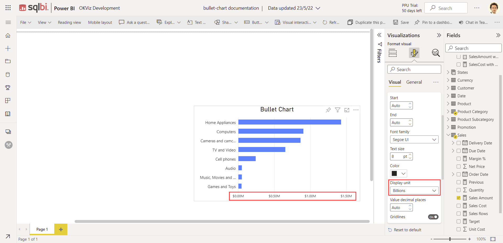
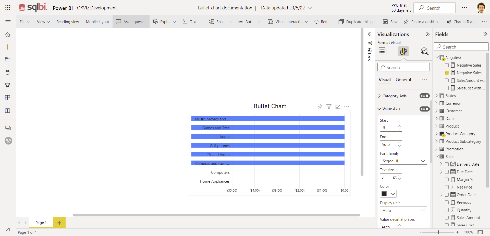
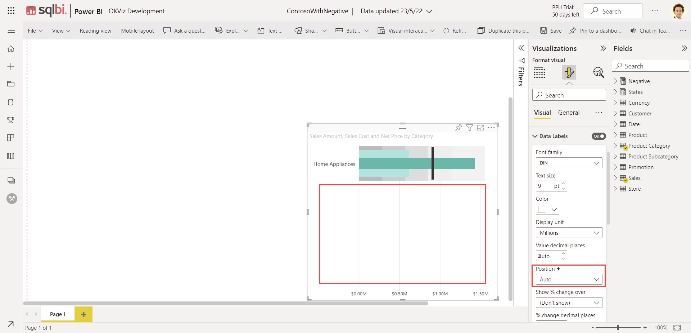

## Value axis

**Display unit**

Property display unit not working. To reproduce, try changing display unit with Sales amount as Value field

**Display unit**

Start from negative number with negative measure not working properly

Step to reproduce in ContosoWithNegative:

 1. Add NegativeSalesAmount to Value
 2. Add Product Category to Category
 3. Set the Axis value Start option to -5,-6,-7.....

## Data label

**Position**

Position auto is blocking visual rendering in horizontal orientation. 

Step to reproduce in ContosoWithNegative:

    1. Set Orientation to Horizontal
    2. Set Category Value show: On
    3. Set Data Label show: On
    4. Set Data label Position: Auto

