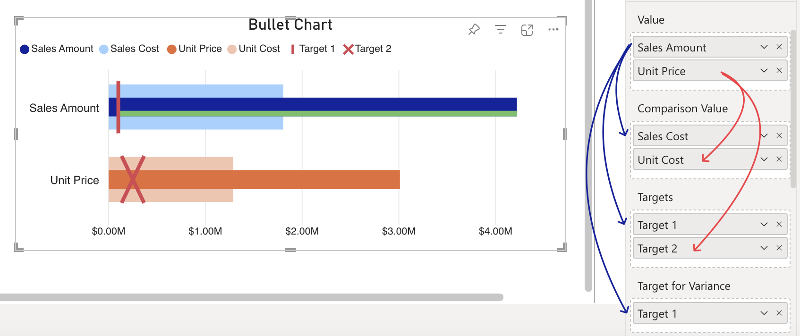

Each measure connected to the **Value** field can be associated with a measure connected to the fields: **Comparison Value**, **Target** and **Target for Variance**. The **Value** field will only accept more than one measure when no column is linked to the **Category** field.
The connected measures will be associated according to the order in which they are entered in the respective fields (the first measure in the **Value** field will be connected to the first measure connected to the **Target** and/or **Comparison Value** and/or **Target for Variance** fields, and so on). 

