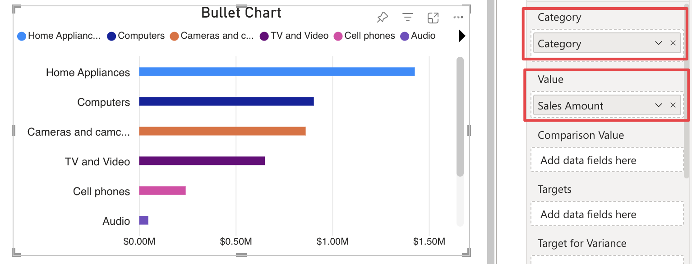

related:
    - category.md
    - comparison-value.md
    - targets.md
    - target-variance.md    

This field allows you to connect the column or measure you wish to show as the main value to which other indicators (**Comparison Value**, **Target**, **Target for Variance** and **States**) are related. 
Connecting a measure or column to this field is essential to display bars. If a **Category** is connected, the field will only accept one measure, displaying one bar for each category value.

Or, it can accept more than one connected measure when the **Category** field is not populate. 

Read how the visual works with more **Value** measure at [Multiple Measures](./../features/multiple-measures.md).