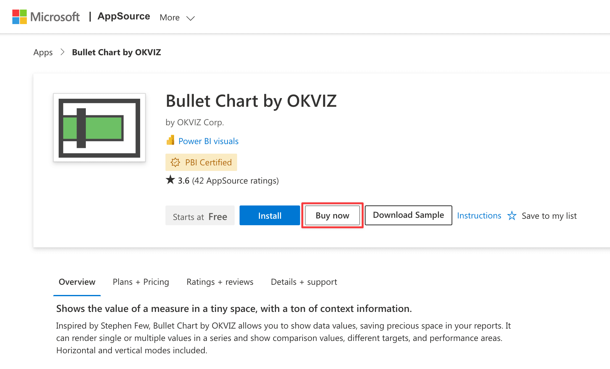
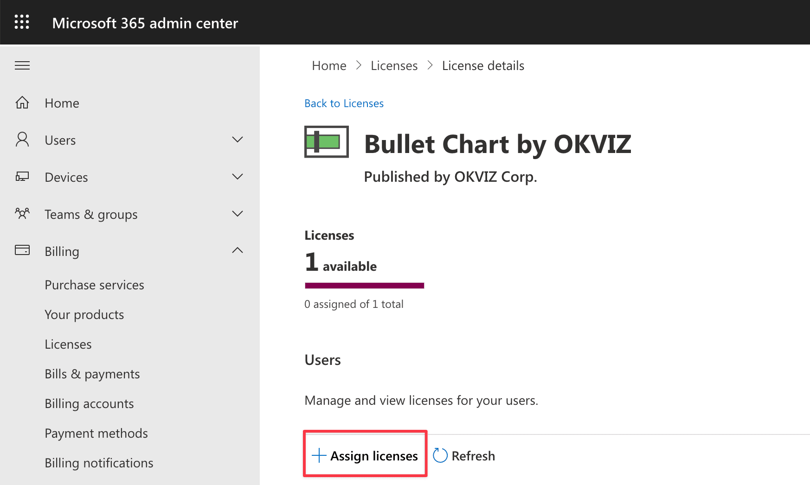
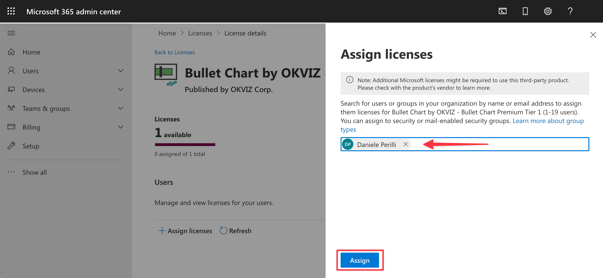
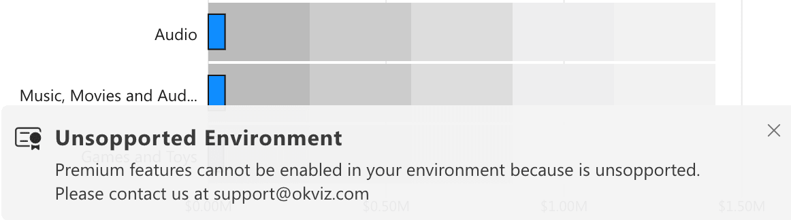

Bullet Chart is a free visual but [some features](options/premium/index.md) require a valid license to be used. We adhere to the ***ISV app licensing system*** provided by Microsoft to allow users to purchase and manage licenses easily.
> **Power BI Embedded / Report Server**: Bullet Chart cannot be licensed on Power BI Embedded or Report Server using the system described on this page. If you are in one of these environments, please [contact us](mailto:support@okviz.com?title=Bullet+Chart+Unsupported+Env)

## Purchase Licenses

Here is an overview of the process required to obtain licenses for Bullet Chart:

1. Estimate the number of users who will use Bullet Chart and, therefore, the number of licenses required. You can do this simply by **adding up** the number of people designing reports containing the visual with who will view them. For example:

    | Designers | Viewers | Licenses Required |
    | --- | --- | --- |
    | 1 | 0 | 1 |
    | 10 | 50 | 60|
    | 10 | 10,000 | 10,010 |

    > If you don't get enough licenses, some of your users will see an [unlicensed notification](#unlicensed-notifications).

2. Visit the [Bullet Chart page on AppSource](https://appsource.microsoft.com/en-us/product/power-bi-visuals/WA104380953) and press the ***Buy now*** button.

    

3. Choose the plan that bets fits you requirements and press ***Next***.

    

4. Choose the billing terms, recurring option and the exact number of users to license.

    

5. Complete the checkout by providing a valid payment method and confirming the purchase.

## Assign Licenses

After you have purchased one or more licenses, you need to assign them to your users or Active Directory groups.

> You must be a Global, License, or User admin to assign licenses. To use group-based licensing, see [Assign licenses to users by group membership in Azure Active Directory](https://docs.microsoft.com/en-us/azure/active-directory/users-groups-roles/licensing-groups-assign)

Follow these steps to proceed:

1. Sign in to your [Microsoft 365 admin center](https://admin.microsoft.com/Adminportal/Home#/licenses)

2. On the navigation menu, select Billing > Licenses.

3. Click on ***Assign License*** and select the users or groups to assign the license to.

    

    

4. Press ***Assign*** and you are done.

At this point the users you have selected will be able to use all the features of Bullet Chart.

## Unlicensed Notifications

If you are using Bullet Chart without a valid license, premium features are read-only: this means that you can play with them and try different configurations, but each option will be reset to its original value after a few seconds. Also some notifications will be displayed:

- Upgrade notification: 

    

- Feature reset notification:

    

- Power BI Embedded / Report Server environment:

    
