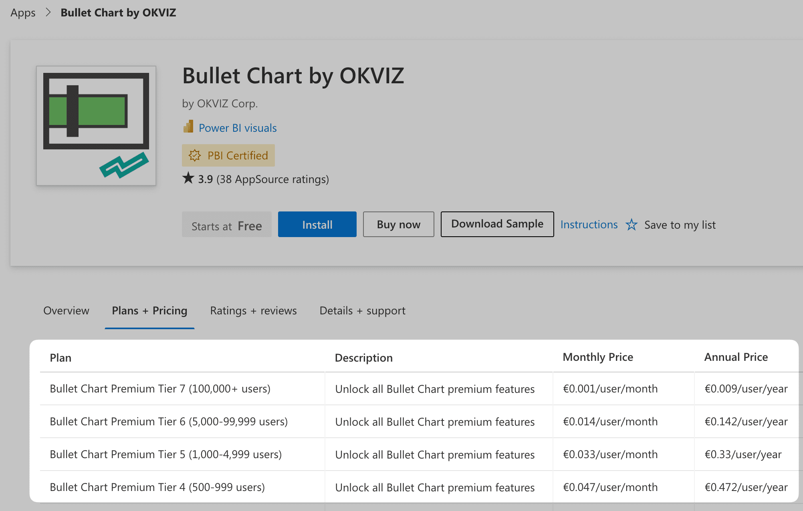

Bullet Chart is a free visual but [some features](options/premium/index.md) require a valid license to be used. We adhere to the ***ISV app licensing system*** provided by Microsoft to allow users to purchase and manage licenses easily.

## How to Get Licenses

Here is an overview of the process required to obtain licenses for Bullet Chart:

1. Estimate the number of users who will use Bullet Chart and, therefore, the number of licenses required. You can do this simply by **adding up** the number of people designing reports containing the visual with who will view them.  
    For example:

    | Designers | Viewers | Licenses Required |
    | --- | --- | --- |
    | 1 | 0 | 1 |
    | 10 | 50 | 60|
    | 10 | 10,000 | 10,010 |

    If you don't get enough licenses, some of your users will see an [invalid license notification](#invalid-license-notifications) or won't be able to use the visual at all.

2. Visit the [Bullet Chart page on AppSource](https://appsource.microsoft.com/en-us/product/power-bi-visuals/WA104380953) and purchase a plan that best suits your requirements. 

    

3. Assign the license(s) to yourself, your users or Active Directory groups via [Microsoft 365 admin center](https://admin.microsoft.com/Adminportal/Home#/subscriptions)

4. At this point, users with a valid license will be able to see and use all the features of Bullet Chart.

> **Power BI Embedded / Report Server**: Bullet Chart cannot be licensed on these environments using the system described on this page. Please, [contact us](mailto:support@okviz.com?title=Bullet+Chart+Unsupported+Env) to get an offer for this scenario.

## Unlicensed Notifications

If you are using Bullet Chart without a valid license, its premium features are read-only: this means that you can play with them and try different configurations, but each option will be reset to its original value after a few seconds.

- Upgrade notification: 

    <todo>Screenshot</todo>

- Reset notification:

    <todo>Screenshot</todo>

- Power BI Embedded / Report Server notification:

    <todo>Screenshot</todo>

#### Related Resources:
- [Power BI AppSource visual license models](https://docs.microsoft.com/en-us/power-bi/developer/visuals/custom-visual-licenses)
- [ISV App License Management](https://docs.microsoft.com/en-us/azure/marketplace/isv-app-license-power-bi-visual)
