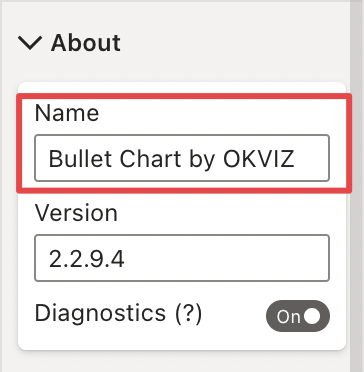
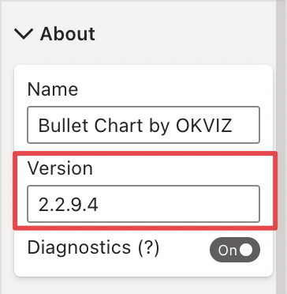

This properties group displays basic visual's information 

## Name

The name of the visual

## Version

The current version of visual

## Diagnostics

**Default value:** Off

If selected, this option logs significant information and errors in the script console of the browser. This could affect the performance of your report.

