Options in this section allow to change bars' appearance for each bullet. All options in this section are [Premium options](premium.md).

Let us have a look at these options one by one:

## Border

**Default value:** Off

If enabled, draws a border outline for the bullet bar.

## Border color

Defines border outline color.

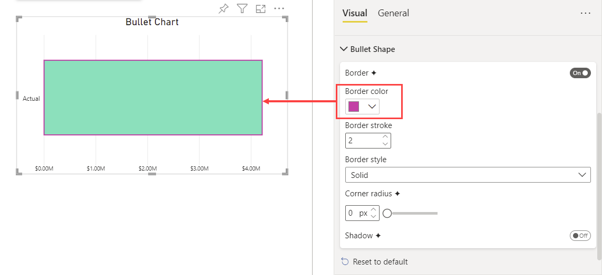

## Border stroke

**Default value:** 1px

Defines the border stroke width.

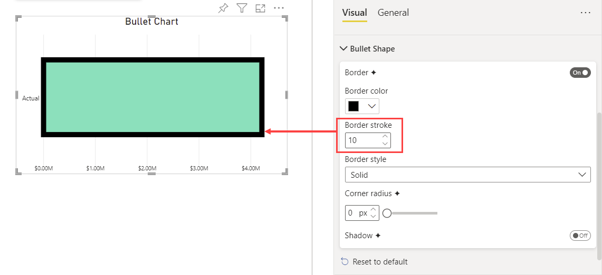

## Border style

**Default value:** Solid

Defines the style of the border line. It provides three options to choose from:

- **Dashed:**  Line made up of short strokes with breaks in between 

    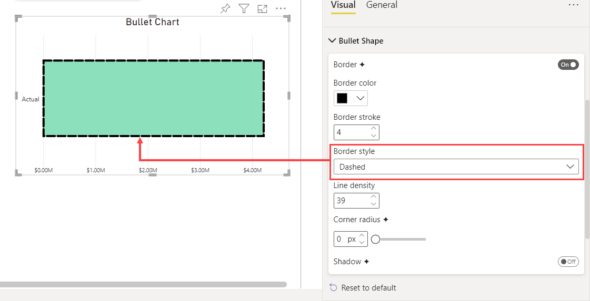   

- **Solid:** Solid line without breaks

    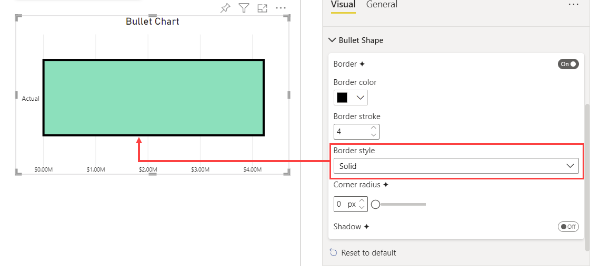   

- **Dotted:** Line made up of dots with breaks in between 

    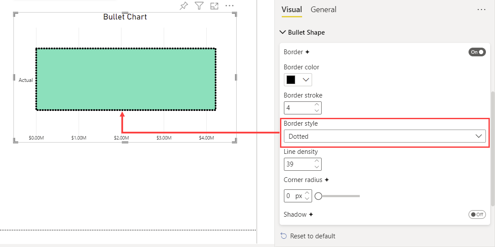   

## Line density 

**Default value:** 40

This option is only visible when **Border style** is set to ***Dashed*** or ***Dotted***. Defines the distance between dashes/dots of the border line: the smaller the value, the greater the distance.

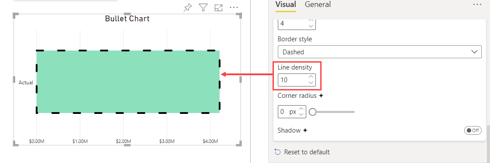

## Corner radius

**Default value:** 0px

Allows to define the bars' curve on the corners. 

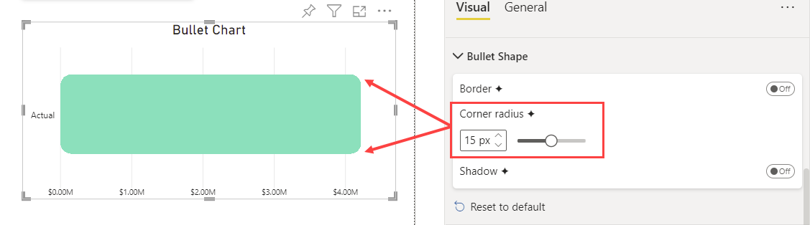

## Shadow

**Default value:** Off

If enabled, add a shadow to bars.

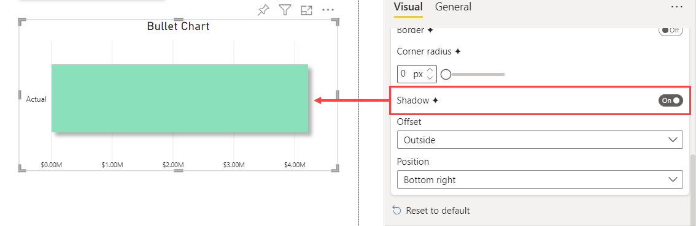

## Offset

**Default value:** Outside

Defines the offset of the shadow relative to the bar. Provides two options to choose from:

- **Outside:** The shadow is placed outer the bar, as in the previous image 

- **inside:** The shadow is placed within the bar

    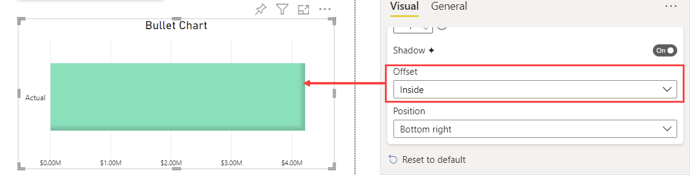

## Position

**Default value:** Bottom right

Defines the position of the shadow relative to the bars. 

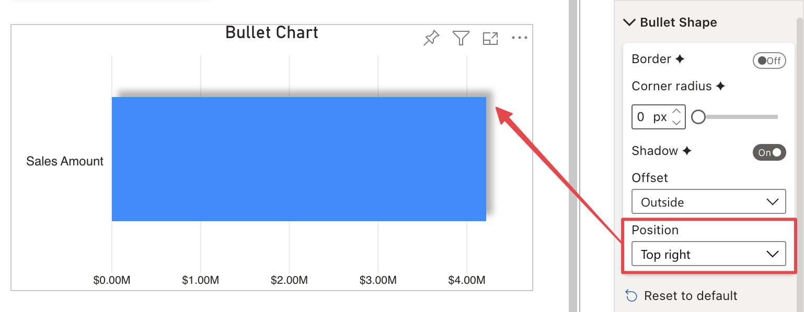

For both **Offset** options - ***Inside*** or ***Outside*** - provides the following position options to choose from:

- **Bottom right**  

- **Bottom**

- **Bottom left** 

- **Right**

- **Center**

- **Left**

- **Top right**  

- **Top**

- **Top left** 

## Shadow (comparison)

**Default value:** Off

This option is shown only when a comparison value is connected. 

If enabled, the shadow is also applied to the comparison value bar, with same **Offset** and **Position**

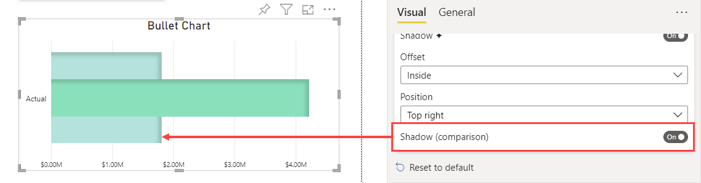

