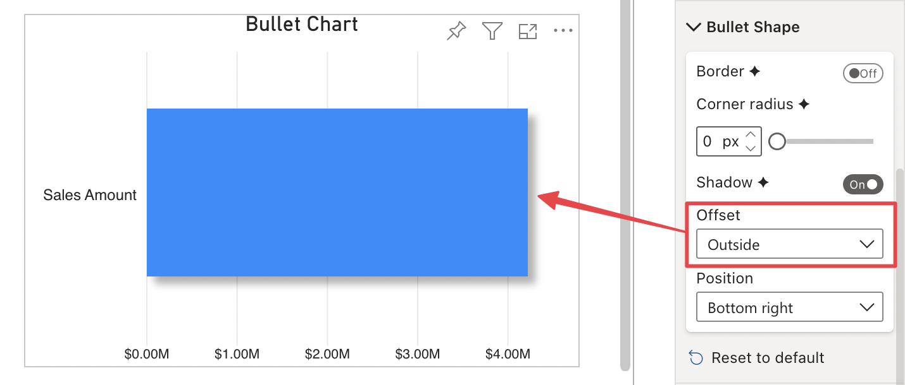
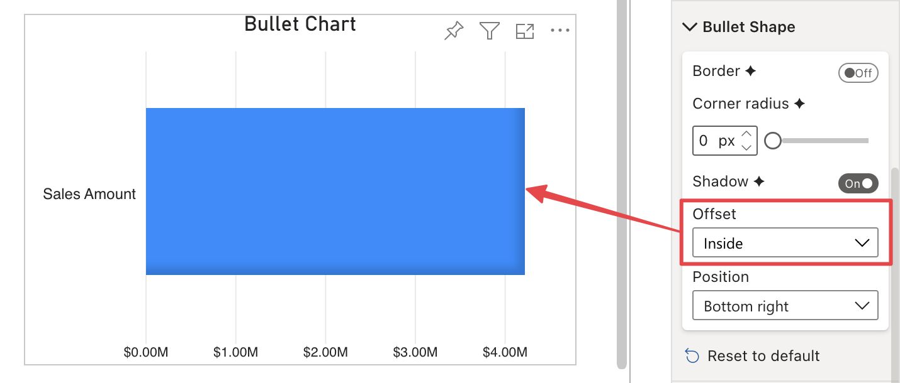

**Default value:** Outside

This option is only visible when [Shadow](shadow.md) is enabled and it defines the offset of the shadow relative to the bar. Provides two options to choose from:

- **Outside:** The shadow is placed outer the bar.

    

- **inside:** The shadow is placed within the bar.

    