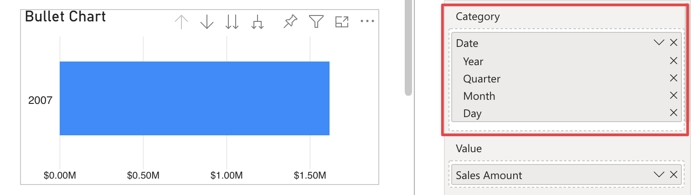

**Default value:** On

This options is only visibile when a ***Category*** is connected to the relative field and it allows to show axis labels with the related hierarchy path. In order to display labels with the hierarchical path, it is first necessary to connect a hierachy in the ***Category*** field and then expand all down level.

<video src="images/concatenate-labels.mp4" width="700" autoplay loop muted></video>

