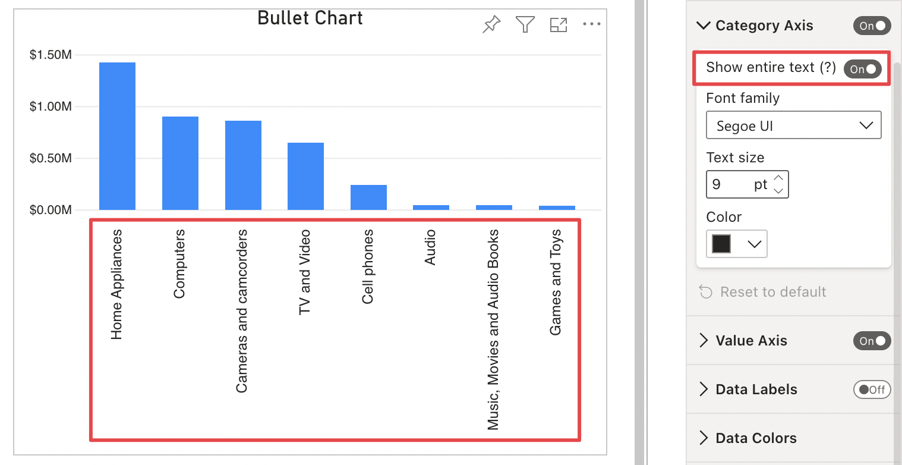
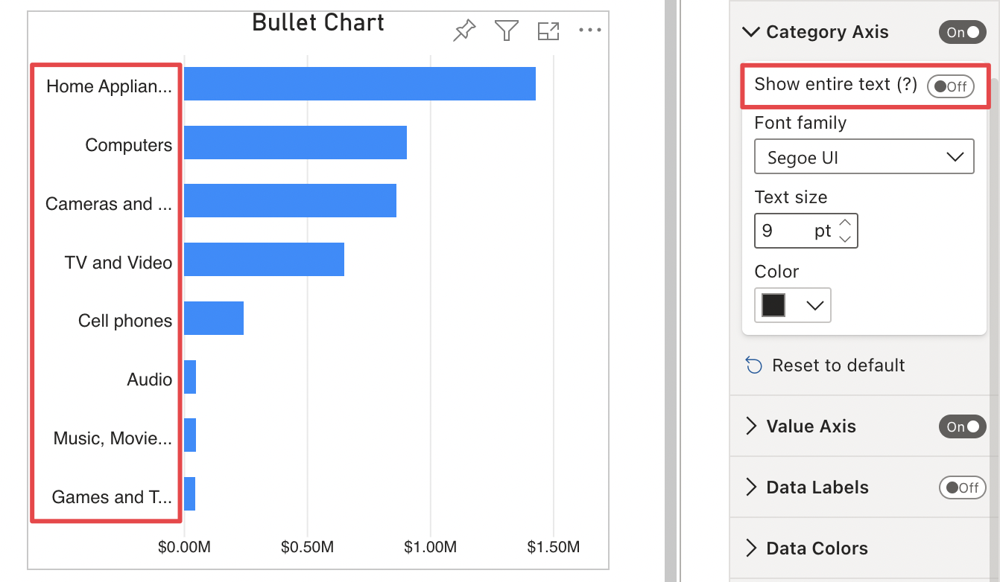
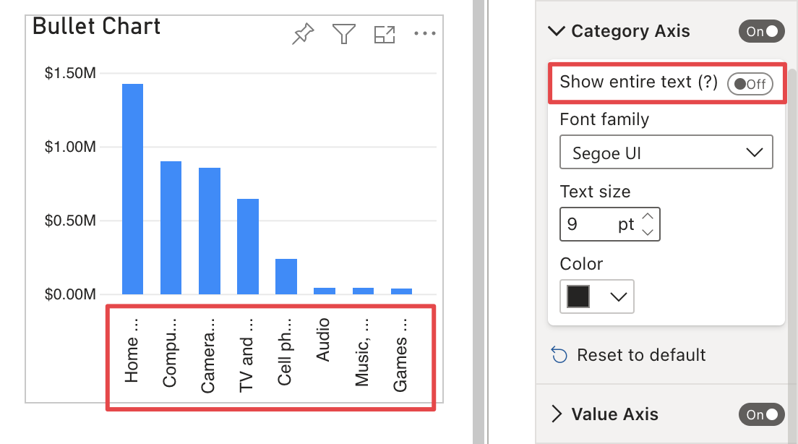

**Default value:** On

If enabled, this option automatically enlarges the category axis to display the entire labels text. Labels will be displayed according to the **Orientation** of the visual:

- **Horizontal**

    

- **Vertical**

    

If it is inactive, labels' size will adapt to the category axis available space, with slightly different behavior depending on the visual's **Orientation**:

- **Horizontal:**  Label text could be truncated with ellipsis, according to the available axis space. Labels' orientation always remains horizontal.

       

- **Vertical:** Label text could be truncated with ellipsis, according to the available axis space. Label orientation could be horizontal or at a 35/90-degree angle, depending on the height and width set for the visual.

    

    

    