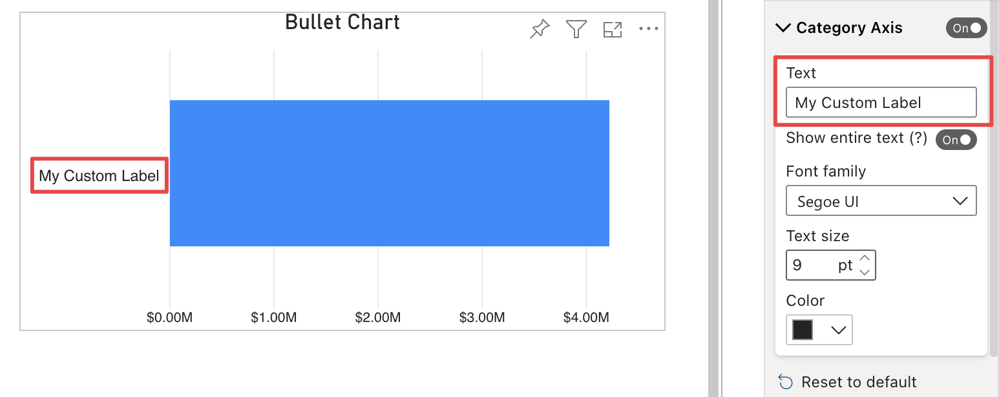

**Default value:** Auto

This option is only visible when no measures are connected to the ***Category*** field and there is only one measure connected to the ***Value*** field.

***Auto*** means that the category name displayed will be the same as the name of the measure connected to the ***Value*** field.

When edited, the text option allow a custom name to be assigned to the axis label.

