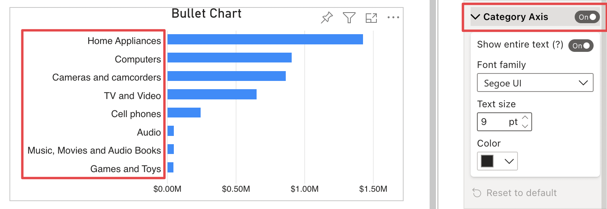
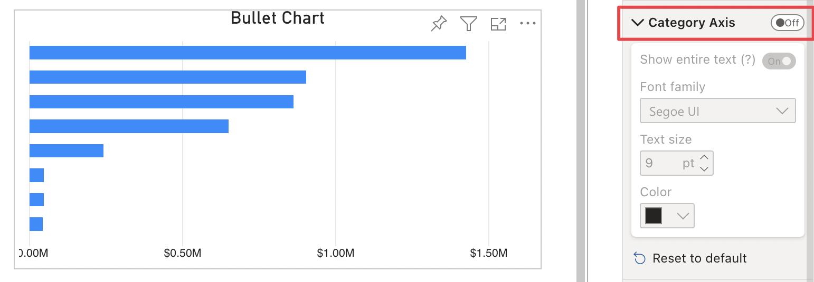
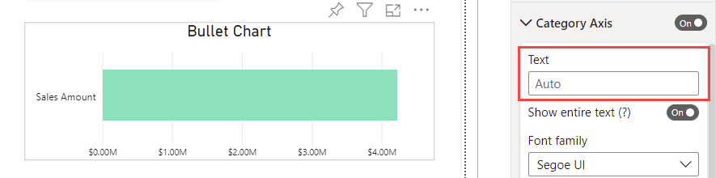
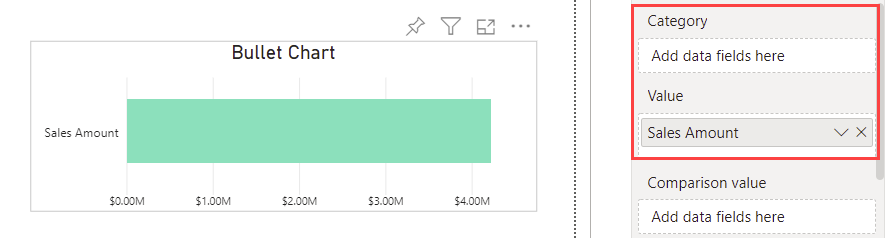
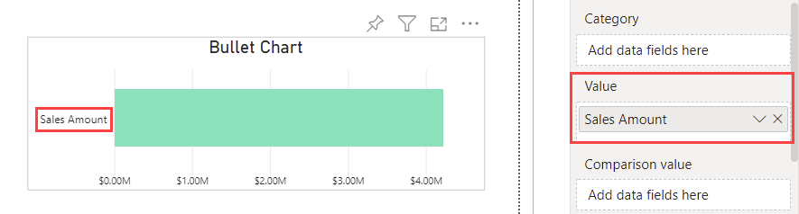
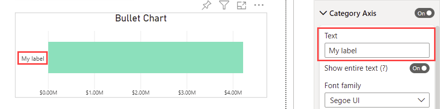
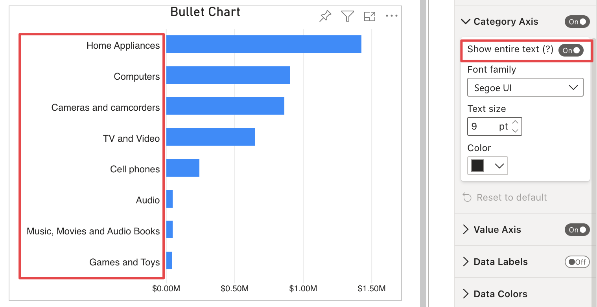
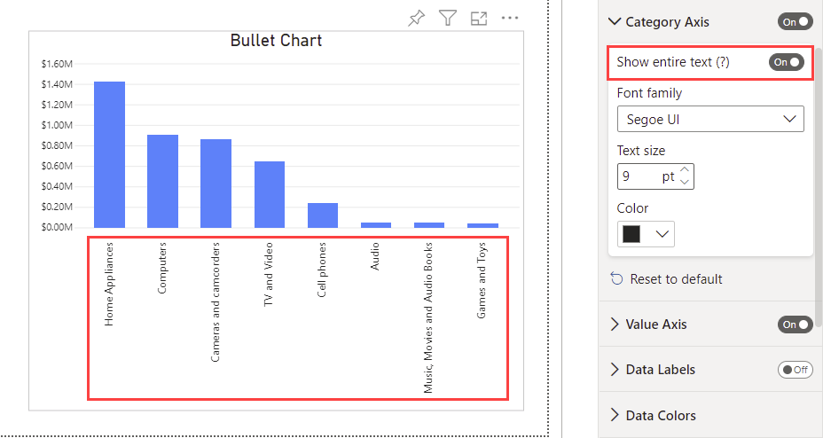
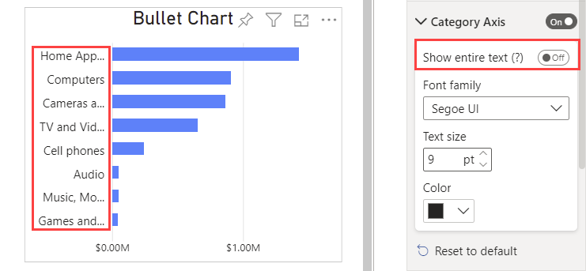
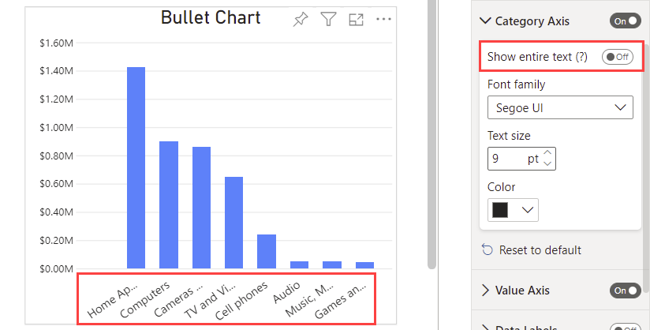

**Default value:** On

When enabled, this options' section displays category axis labels and allows to edit their appearance.

If set to **Off**, this options' section hides the category axis and disables the related display options.

## Text 

**Default value:** Auto

This option is only visible when no measures are connected to the **Category** field and there is only one measure connected to the **Value** field.

***Auto*** means that the category name displayed will be the same as the name of the measures connected to the **Value** field.

When edited, the text option allow a custom name to be assigned to the axis label.

## Show entire text

**Default value:** On

If enabled, this option automatically enlarges the category axis to display the entire labels text. Labels will be displayed according to the **Orientation** of the visual:

- **Horizontal**

    

- **Vertical**

    

If it is inactive, labels' size will adapt to the category axis available space, with slightly different behavior depending on the visual's **Orientation**:

- **Horizontal:**  Label text could be truncated with ellipsis, according to the available axis space. Labels' orientation always remains horizontal.

       

- **Vertical:** Label text could be truncated with ellipsis, according to the available axis space. Label orientation could be horizontal or at a 35-degree angle, depending on the height and width set for the visual.

    <todo> Add 90-degree label orientation with truncate text screenshoot </todo> 

    

    

## Font family

**Default value:** Segoe UI

This option specifies the font used to display the category labels

## Text size

**Default value:** 9px

Defines the size of the font used to display the category labels

## Color

Specifies the color of the text for the category labels
