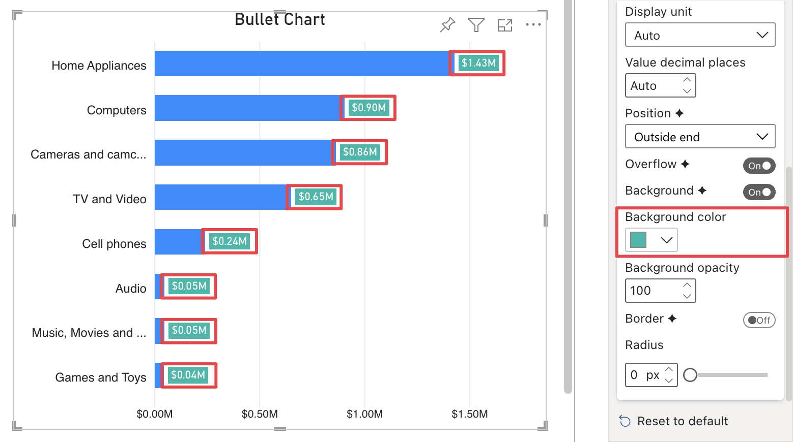

**Default value:** 

This option is only visible if [Background](background.md) is enabled and the [Use data color](use-data-color.md) option is not set to **Background** or **Background & Border**. It allows to choose a color for data labels' background.

