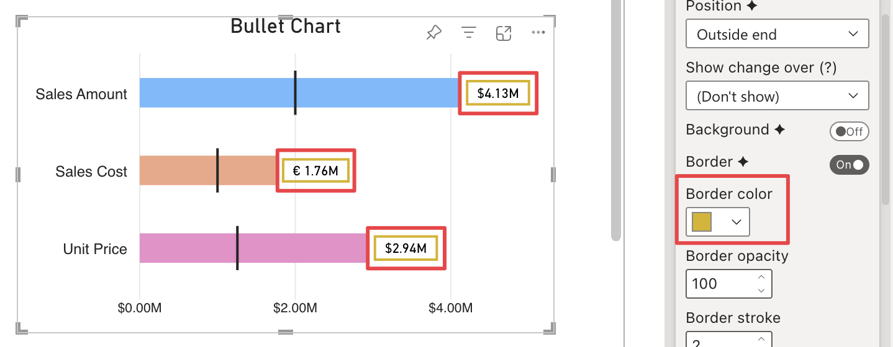

**Default value:** 

Defines border outline color. This option is only visible if [Border](border.md) is active and the [Use data color](use-data-color.md) option is not set to **Border**, **Background & Border** or **Border & Text**.

> This option is not controllable through a [Report Theme](../../features/themes.md).