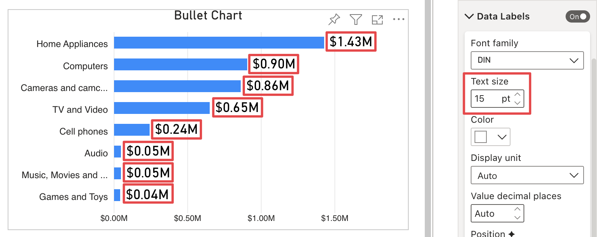
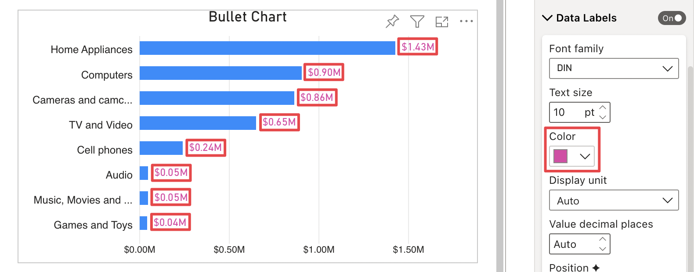
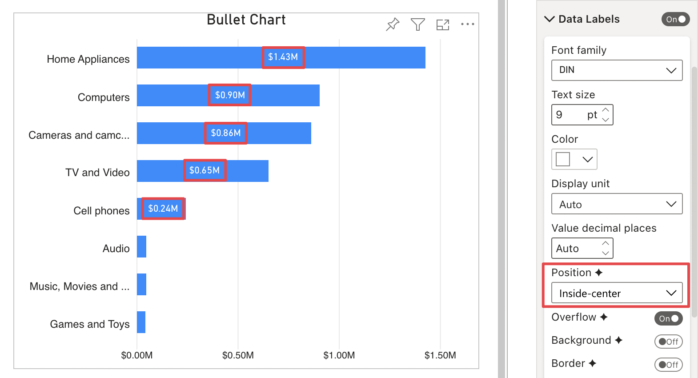
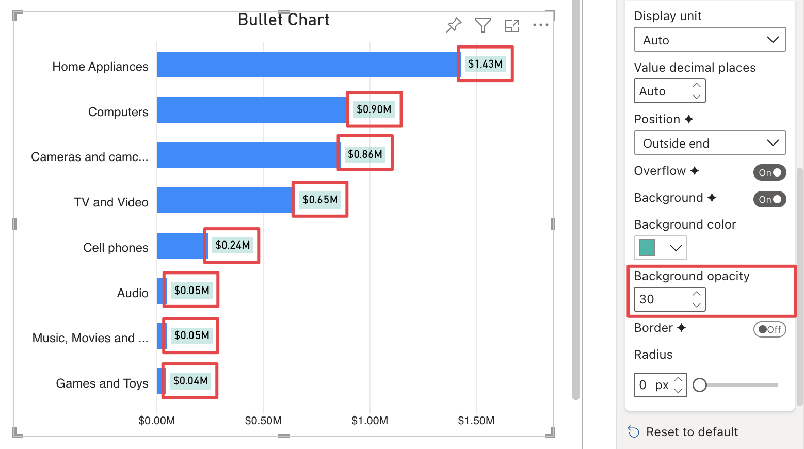
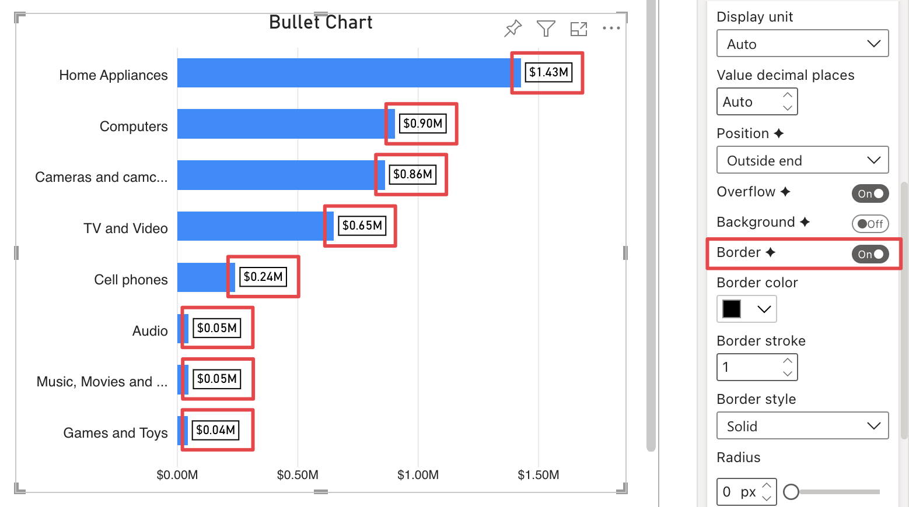
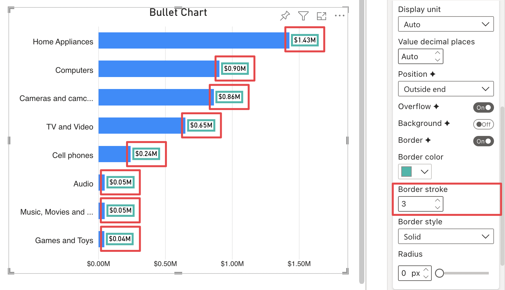
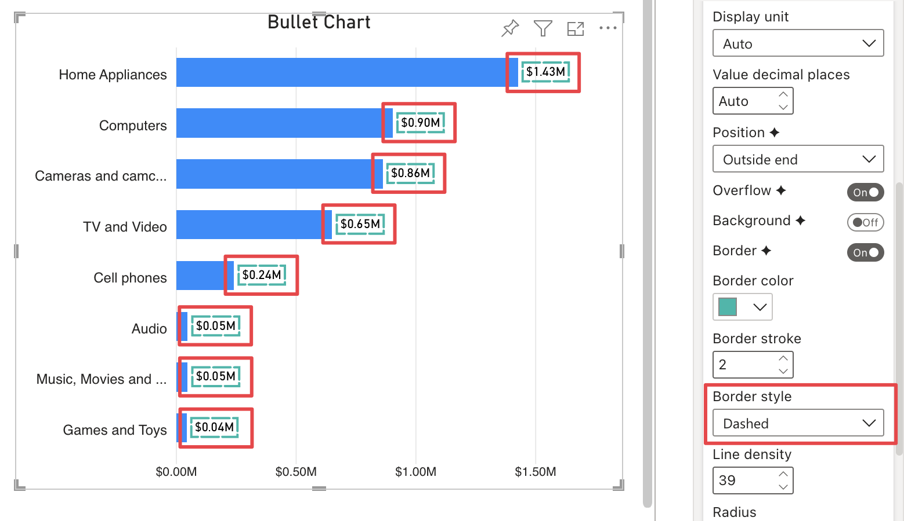
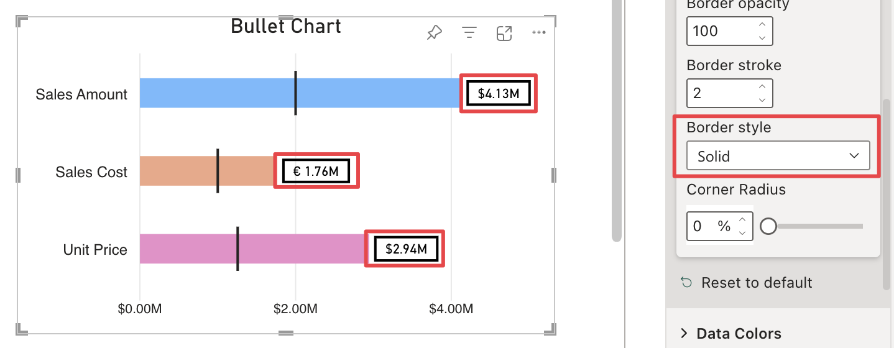

**Default value:** Off

When enabled, this options' section displays data labels and allows to edit their appearance.

## Font Family

**Default value:** Segoe UI

This option specifies the font used to display the data labels.

## Text Size

**Default value:** 9px

Defines the size of the font used to display the data labels.

## Color

Specifies the color of the text for the data labels.

## Display Unit

**Default value:** Auto

This option defines the display unit for the data labels – in Thousands, Millions, Billions,etc.  

> Use *Auto* to display the most relevant display unit for each value depending on how big the number is.   

## Value Decimal Places

**Default value:** Auto

This option defines the number of decimal places for the value of data labels. 

> Use *Auto* to display the most relevant decimal places for each value depending on the total number of decimal places each value has.

## Position

**Default Value:** Auto

> This is a **Premium option**. More information about premium options can be found here: [Premium](general/premium.md)

Allows to specify the position of data labels relative to the bars. The following positioning options are available:

- **Auto:** if there is enough space at the end of the bar, data label is placed outside the bar, otherwise it is placed inside-end. 

    

- **Inside end:** the label is placed inside, at the end of the bar. If the bar is not large enough to contain the label it will not be displayed 

    

- **Outside end:** the bar size is reduced to allow the label to be displayed outside.

    

- **Inside-center:** the label is placed in the middle of the bar. If the bar is not large enough to contain the label it will not be displayed.

    

- **Inside-base:** the label is placed inside, at the base of the bar. If the bar is not large enough to contain the label it will not be displayed.

    

## Overflow

**Default Value:** On

> This is a **Premium option**. More information about premium options can be found here: [Premium](general/premium.md)

When active, this option will always keep data labels visible regardless of the size of the bars. If set to **Off** instead automatically hides the data labels when they are wider than the bars.

<todo> Add 2 screenshots, with and without overflow </todo>

## Background

**Default Value:** Off

> This is a **Premium option**. More information about premium options can be found here: [Premium](general/premium.md)

This option adds a background to data labels.

## Background Color

This option is only visible if **Background** is enabled. It allows to choose a color for data labels' background.

## Background Opacity

**Default Value:** 50

This option is only visible if **Background** is enabled. It Defines the background opacity value of data labels.

  

## Border

**Default Value:** Off

> This is a **Premium option**. More information about premium options can be found here: [Premium](general/premium.md)

This options adds a border to data labels.

  

## Border Stroke

**Default Value:** 1

This option is only visible if **Border** is enabled. It defines the border stroke width.

 

## Border Style

**Default value:** Solid

This option is only visible if **Border** is enabled. It defines the style of the border line. It provides three options to choose from:

- **Dashed:**  Line made up of short strokes with breaks in between.

       

- **Solid:** Solid line without breaks.

       

- **Dotted:** Line made up of dots with breaks in between.

    

## Line Density 

**Default value:** 40

This option is only visible when **Border style** is set to ***Dashed*** or ***Dotted***. It defines the distance between dashes/dots of the border line: the smaller the value, the greater the distance.

## Corner Radius

**Default value:** 0px

Allows to define the data labels' curve on the corners. 

