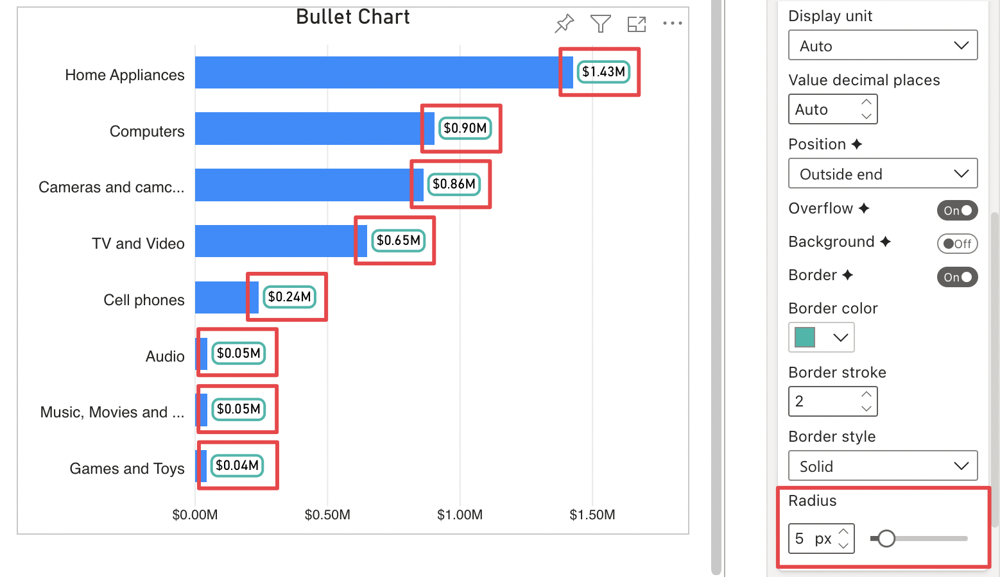

**Default value:** 0

This option is only visible if **Border** or **Background** are active. Allows to define the data labels' curve on the corners. 

<todo>Retake the screenshot since now it is a percentage</todo>