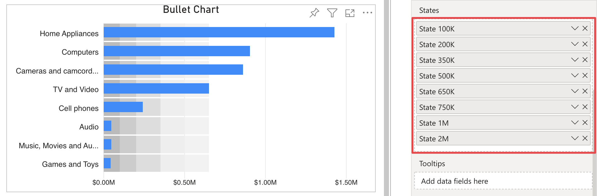
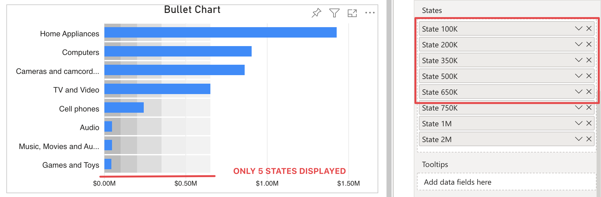

**Default Value:** Off

This option is visible only if there are more than one measure connected to the **States** field. It allows to display all states when more than 5 measures are connected in the **States** field. 

<video src="images/more-than-5-states-on.mp4" width="700" autoplay loop muted></video>

Without an active premium license, measures after the fifth may be added to the "States" field but will not be displayed.

