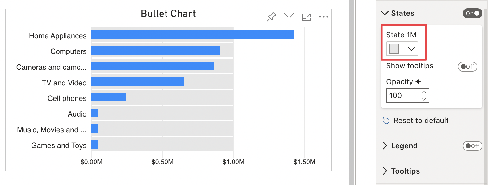
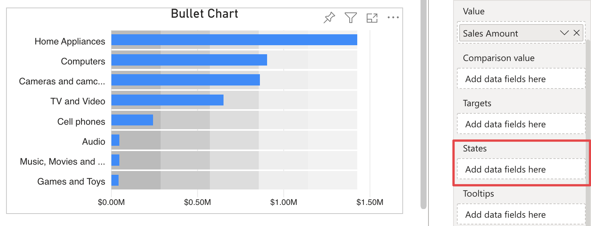

**Default Value:** On

When enabled, this section enables displaying the bullets' states and related options. 

<video src="images/states-on.mp4" width="700" autoplay loop muted></video>

Since some options in this section are data bound, they will be displayed vary depending on the measures connected to the fields.

When a measure is connected to the **States** field, an option with the name of the measure connected to the **States** field is displayed, allowing to choose the color of the related state bar.

If more measures are connected there will be an option for each measure.

Having multiple measures connected to the **States** field will also enable 2 more options: [Auto Sort](auto-sort.md) and [More Than 5 States](additional-states.md).

Bullet Chart also allows to show up to 5 states while having no measures connected to the **States** field. 

In this case, you can manually assign a value and choose a color for each state, starting with the choice of [Value Type](value-type.md).