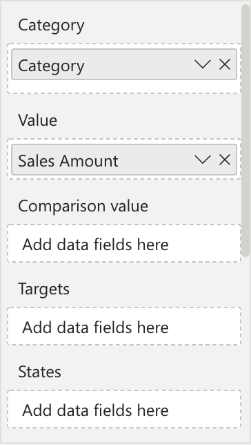
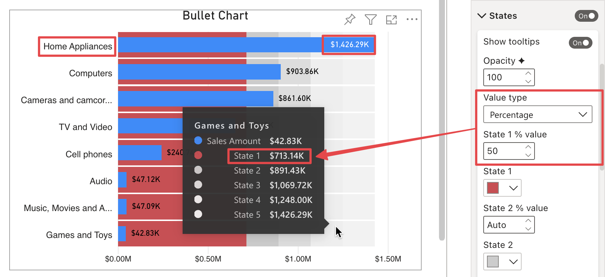
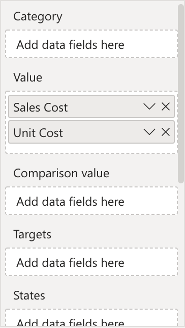

**Default Value:** Percentage

This option is only visible when no measures are connected to the **States** field. This allows to choose the type of value to manually assign to each state, which can be:

- **Absolute Value:** It allows to assign an absolute value for each state.  

     

- **Percentage:** By selecting this option, the value typed is the percentage of the maximum value between measures connected to the **Value** field. Let's take a look few example: 
    
    1. One measure in the **Value** field with **Category**. 

        

        In this case, the percentage is calculated on the highest category value (in the example below: "Home Appliance"). 50% of "Home Appliance" value =  713.14K

        
    
    2. One measure in the **Value** field without **Category**. 

        
        
        In this case, the percentage is calculated on the measure value connected to the **Value** field (in the example below: "Sales Amount"). 50% of "Sales Amount" value =  2,109.96K

        

    3. More measures in the **Value** field without **Category**. 

        

        In this case, the percentage is calculated on the highest measures value in **Value** field (in the example below: "Sales Cost"). 50% of "Sales Cost" value = 902.83K

        

    4. More measures in the **Value** field and more measures in the **Comparison Value** field. 
        
        

        In this case, the percentage is calculated on the highest measures value in both, **Value** and **Comparison Value** field (in the example below: "Sales Amount", that is connected to the **Comparison Value** field). 50% of "Sales Amount" value =  2,109.96K

        

In both **Percentage** or **Absolute Value** selection, is possible to assign an **Auto** value to states, which is also the default value. **Auto** means that state value is calculated as a percentage on the maximum connected measure value, based on how many states are active. So if all 5 states have "Auto" as selected value, each state will be 20% of the maximum connected measure value plus the value of the previous state. 

To turn off one state, just assign "0" as state value. In the example below, since two states are inactive (State2 and State3), the value of the active states (State1, State4 and State5)  is recomputed.

