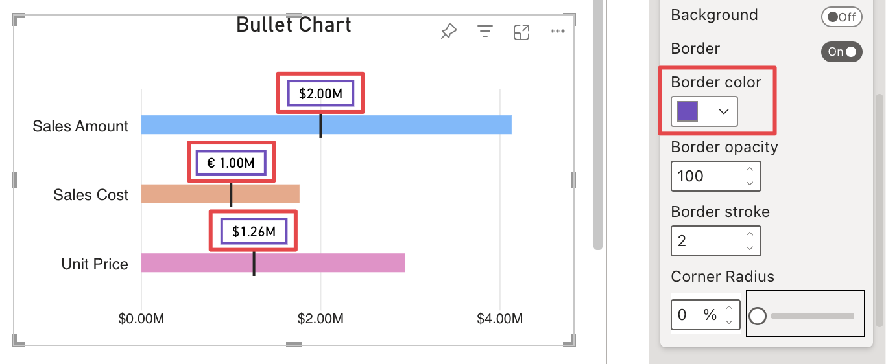

**Default Value:** 

This option allows to be assign a color to the border of target labels and is only visible if [Border](border.md) is active and if [Use Marker Color](use-marker-colour.md) is not set to **Border**, **Background & Border** or **Border & Text**.

