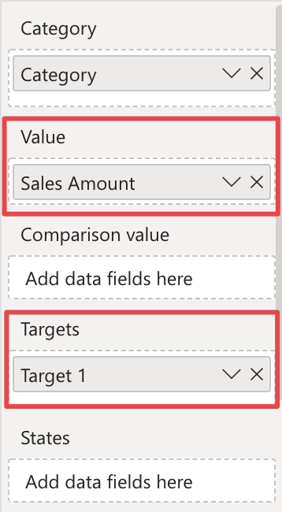
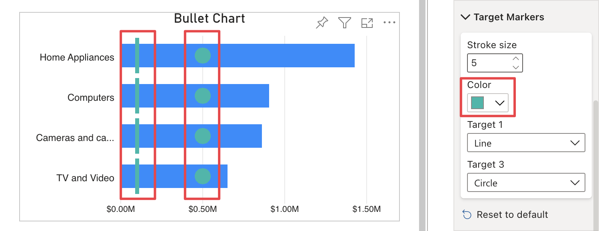
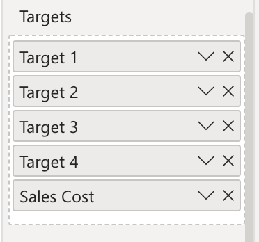

This section includes options to change the appearance of target markers and it is only visibile when there are at least one measure in **Target** field and at least one measure in the **Value** field.

## Stroke Size

This option allows to define the width of the marker stroke.

## Color

This option allows to define the markers color.

For each measures connected to the **Tartgets** field, an option is dissplayed to select the shape of the marker. The available shapes are:

- Line
- Circle 
- Square
- Cross

It is also possibile to select ***(Hidden)*** to hide the related marker.

