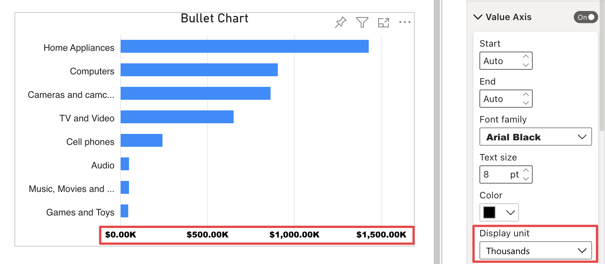

**Default value:** Auto

This option defines the display unit for the value axis labels – in Thousands, Millions, Billions,etc.  

> Use *Auto* to display the most relevant display unit for each value depending on how big the number is.

