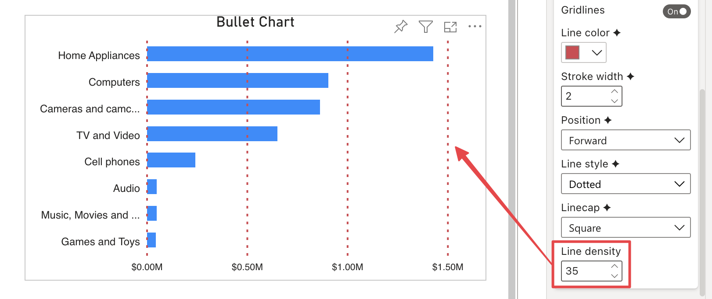

**Default Value:** 20

This option is only visibile if **Gridlines** is enabled and **Line Style** is set to ***Dashed*** or ***Dotted***. It defines the distance between dashes/dots of the gridlines: the smaller the value, the greater the distance.

