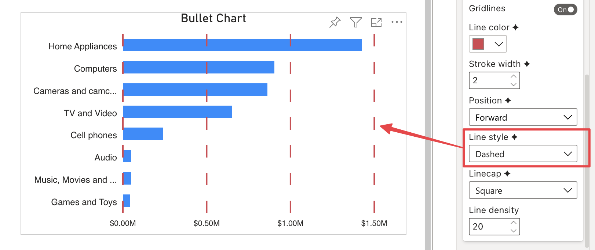
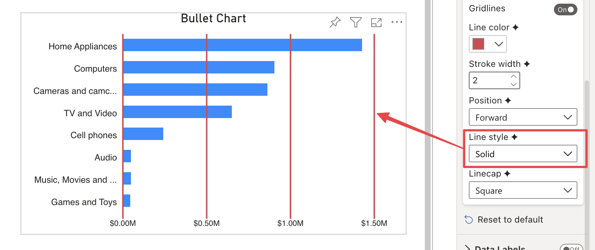

**Default Value:** Solid

This option is only visibile if **Gridlines** is enabled and allows to define gridlines style. It provides three options to choose from:

- **Dashed:**  Line made up of short strokes with breaks in between.

       

- **Solid:** Solid line without breaks.

       

- **Dotted:** Line made up of dots with breaks in between.

    

