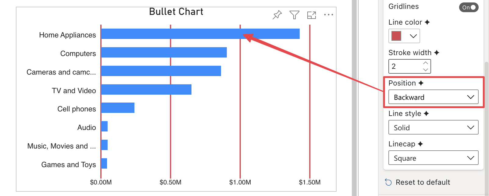

**Default Value:** Backward

This option is only visibile if **Gridlines** is enabled and allows to define gridlines position between:

- **Forward** Gridlines are displayed over the data bars.

    

- **Backward** Gridlines are dispayed under the data bars.

    

