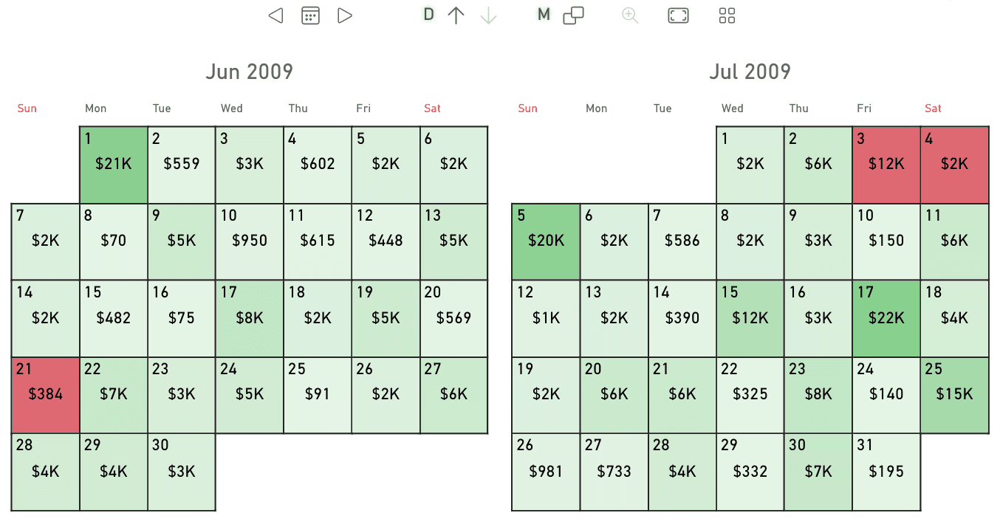

**Calendar Pro** is a powerful calendar visual for Power BI. It includes unique features like granularity drilldown and dynamic grouping, different calendar systems such as Gregorian, Weekly, Fiscal, built-in holidays, events support, and advanced color rules - find more on [okviz.com/calendar-pro](https://okviz.com/calendar-pro)

> [Download and try Calendar Pro](https://appsource.microsoft.com/en-US/product/power-bi-visuals/okvizcorp1634637213047.calendarprobyokviz) from AppSource.