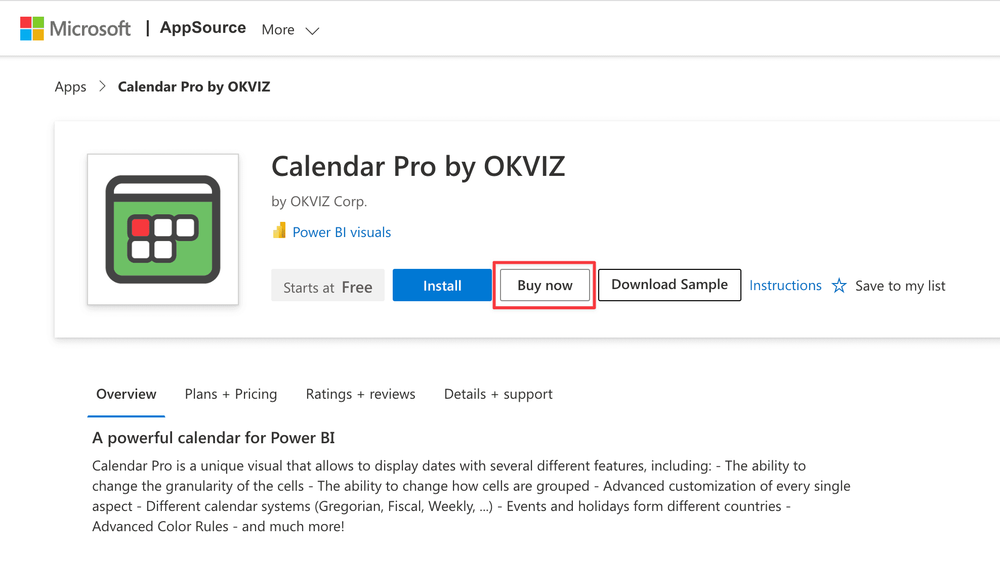
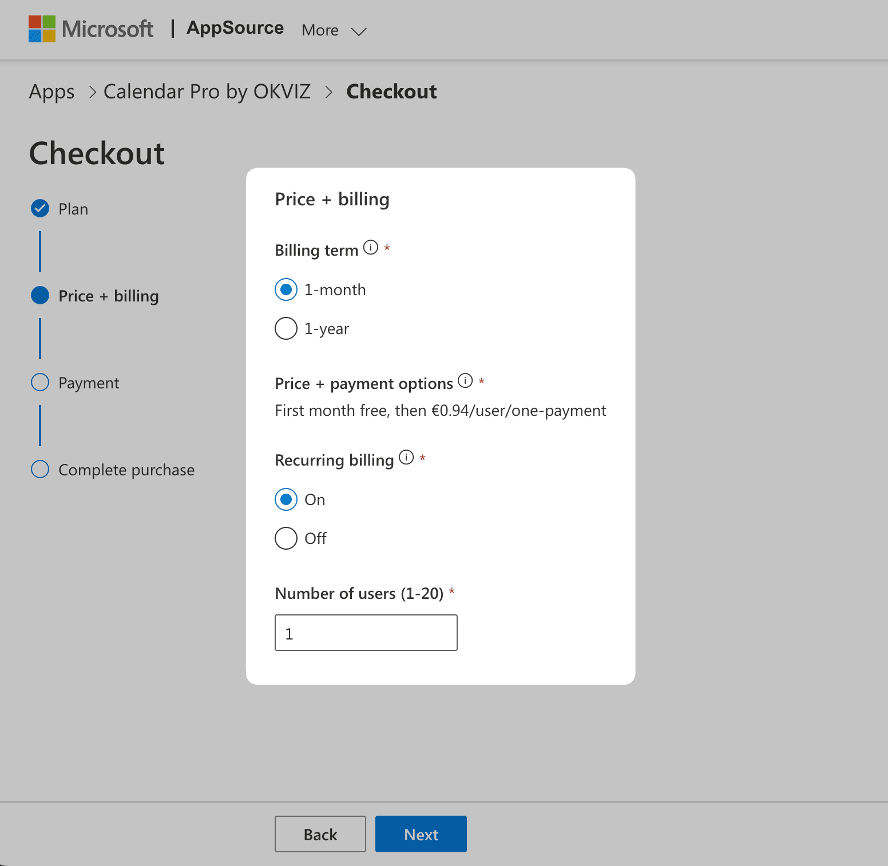
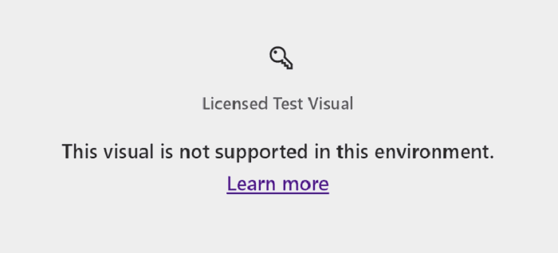

Calendar Pro requires a valid per-user license to be used. We adhere to the ***ISV app licensing system*** provided by Microsoft to allow users to purchase and manage licenses easily.

> **Power BI Embedded / Report Server**: Calendar Pro cannot be licensed on Power BI Embedded or Report Server using the system described on this page. If you are in one of these environments, please [contact us](mailto:support@okviz.com?title=Calendar+Pro+Unsupported+Env)

## Purchase Licenses

Here is an overview of the process required to obtain licenses for Calendar Pro:

1. Estimate the number of users who will use Calendar Pro and, therefore, the number of licenses required. You can do this simply by **adding up** the number of people designing reports containing the visual with who will view them. For example:

    | Designers | Viewers | Licenses Required |
    | --- | --- | --- |
    | 1 | 0 | 1 |
    | 10 | 50 | 60|
    | 10 | 10,000 | 10,010 |

    > If you don't get enough licenses, some of your users will see an [unlicensed notification](#unlicensed-notifications).

2. Visit the [Calendar Pro page on AppSource](https://appsource.microsoft.com/en-US/product/power-bi-visuals/okvizcorp1634637213047.calendarprobyokviz)  and press the ***Buy now*** button.

    

3. Choose the plan that bets fits you requirements and press ***Next***.

    

4. Choose the billing terms, recurring option and the exact number of users to license.

    

5. Complete the checkout by providing a valid payment method and confirming the purchase.

## Assign Licenses

After you have purchased one or more licenses, you need to assign them to your users or Active Directory groups.

Follow these steps to proceed:

1. Sign in to your [Microsoft 365 admin center](https://admin.microsoft.com/Adminportal/Home#/licenses)

2. On the navigation menu, select ***Billing*** > ***Licenses***.

3. Click on ***Assign License*** and select the users or groups to assign the license to.

    

    

4. Press ***Assign*** and you are done.

At this point the users you have selected will be able to use all the features of Calendar Pro.

## Unlicensed Notifications

If you are using Calendar Pro without a valid license, you will see different notifications based on your environment:

- Power BI Desktop / Power BI service in ***Edit view***: 

    

- Power BI service in [Reading view](https://docs.microsoft.com/en-us/power-bi/consumer/end-user-reading-view#reading-view):

    
 
- Power BI Embedded / Report Server environment:

    

