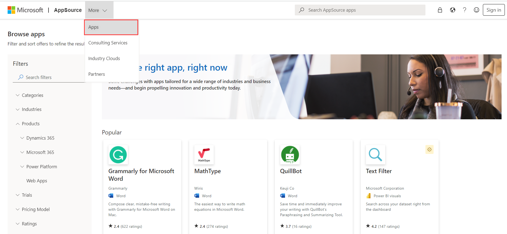
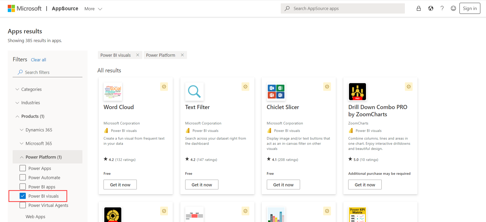
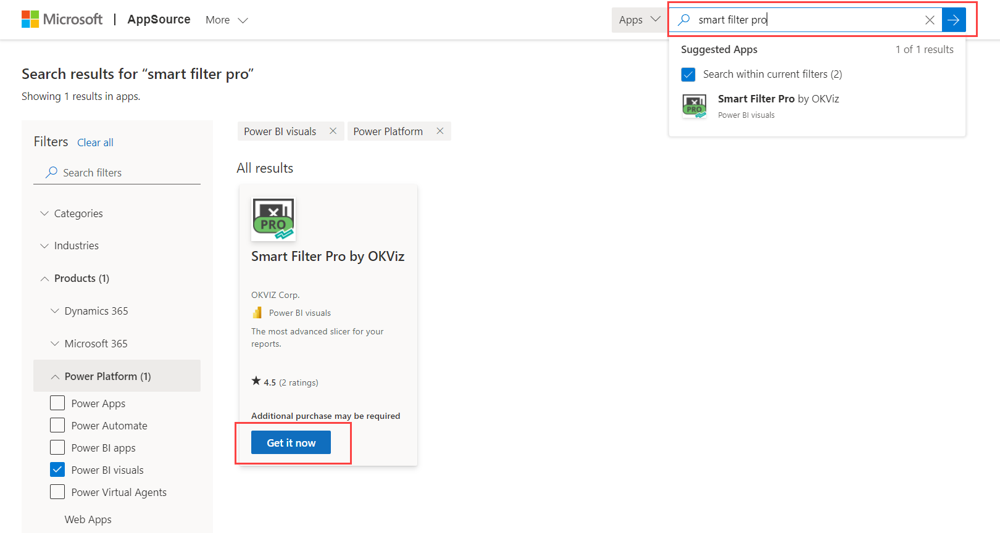

## How to Use a Custom Visual

The vast collection of Power BI custom visuals can be explored from the [Microsoft AppSource](https://appsource.microsoft.com/en-US/marketplace/apps?product=power-bi-visuals). These Power BI visuals, basically, are packages that include code for rendering the data served to them. They are packaged as *.pbiviz file*.   

Custom visuals can be downloaded from the Microsoft AppSource and can then be imported into a Power BI report.

### Downloading Custom Visual from Microsoft AppSource    

- Go to the Microsoft AppSource website, and select the ***Apps*** tab from the bar on the top.   

  

- Select ***Power BI Visuals*** options.  

   

- You can browse the list of available custom visuals, or search for the required custom visual. Select the required visual and click on ***Get it*** now.  

  

- Click on ***Accept and download*** in the next window, and the file will be downloaded.  

  

### Importing Custom Visual from File  

- Import the *PBIVIZ* file into Power BI Desktop by selecting ***Import a custom visual*** from the ellipsis in the ***Visualizations*** pane.  

     

  

- Select the *PBIVIZ* file in the folder you downloaded it to, then select ***Open***. The visual will appear as a new icon in the ***Visualizations*** pane.     

   

This completes the installation process of the custom visual, and the visual is ready to be used.

