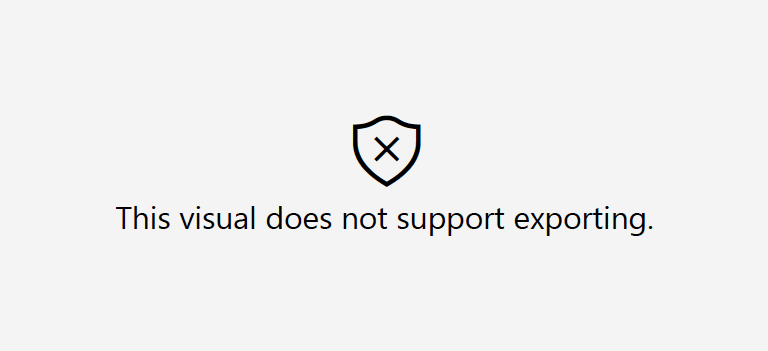

Custom visuals, like any other software, can contain malware code and steal data.
To make Power BI users more secure, Microsoft set up a certification program for visuals developed by third-party vendors, such as OKVIZ.   

The certification guarantees that the visual meets certain requirements like:

- Not calling **external services** except Power BI core services
- Not storing underlying data anywhere
- Not using **insecure code** and adhering to some coding standards
- Using the latest SDK API available

> You can find all the requirements in the following article, although its target audience is developers and some terms/concepts may be a bit obscure to you: [Get your Power BI visual certified](https://docs.microsoft.com/en-us/power-bi/developer/visuals/power-bi-custom-visuals-certified#certification-requirements)

The certification is optional; vendors are not required to apply it to their visuals in order to be published in the marketplace (AppSource). **Power BI visuals that aren't certified, aren't necessarily unsafe.**

## Certified Visuals

Here is a list of OKVIZ visuals that are certified:

- Bullet Chart
- Candlestick
- Card with States
- Dot Plot
- Smart Filter (Free)
- Sparkline
- Synoptic Panel

## Uncertified Visuals

These OKVIZ visuals, instead, are not yet certified:
- Calendar Pro (*Certification ongoing...*)
- Smart Filter Pro - [Why not?](../smart-filter-pro/security.md#certification)

### Limitations

Uncertified visuals have some limitations, compared to the licensed visuals:

- Cannot be **exported to PDF/Power Point** files
- Cannot be included in **email subscriptions** for Power BI reports

These limitations mean that if, for example, you export a report containing an uncertified visual as a PDF, the canvas area where the visual should have appeared is replaced with this error placeholder:

### Enabled Uncertified Visuals

Uncertified visuals may be disabled in your organization; refer to this page if you need to enable them: [Enable Custom Visuals](../get-started/installation.md#enable-custom-visuals)