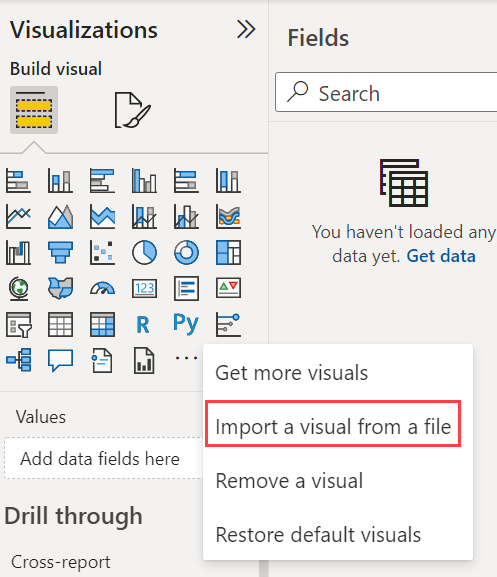
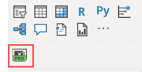
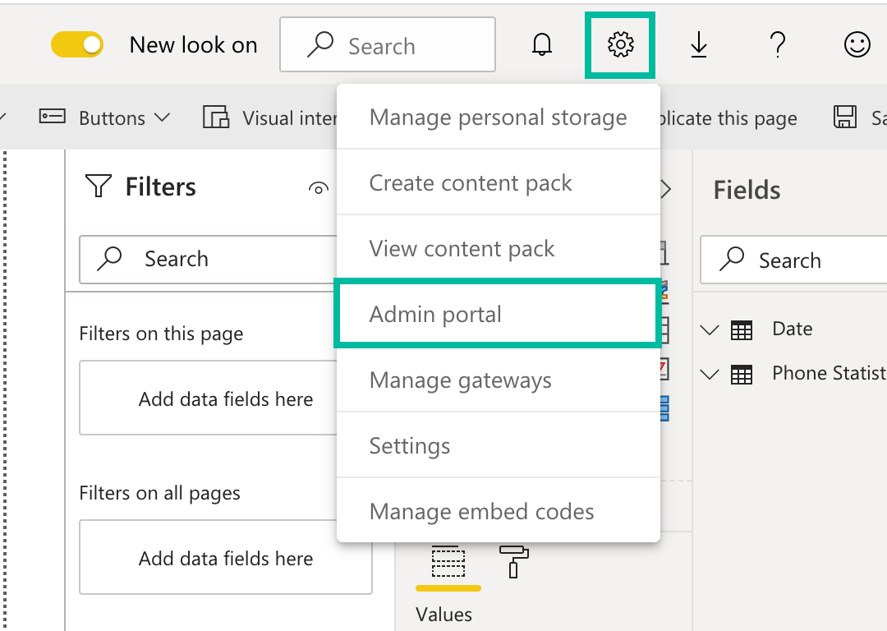
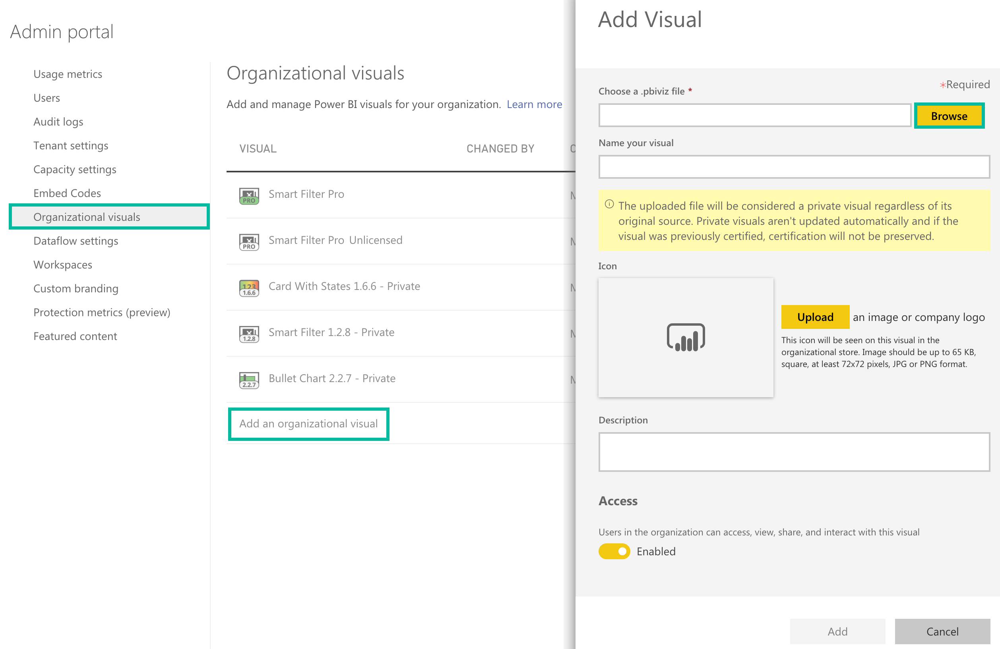
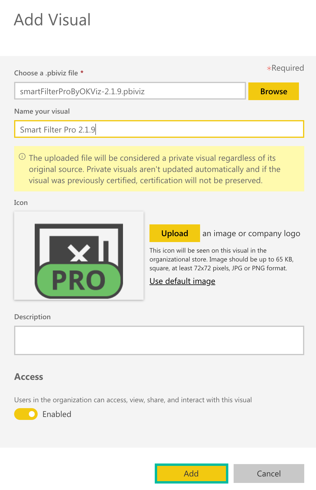
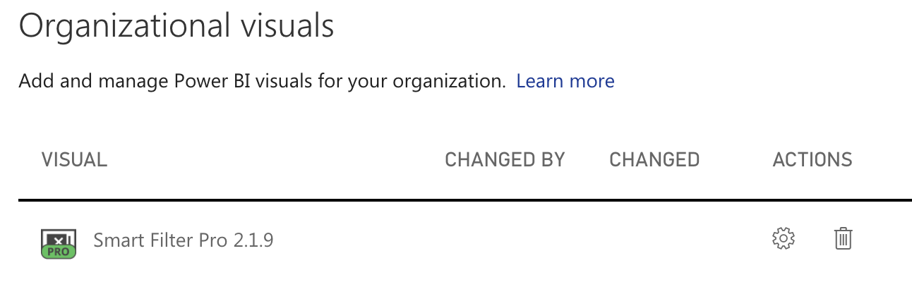
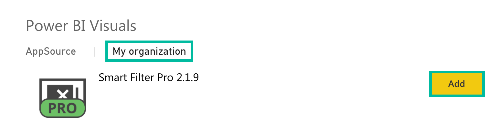

OKVIZ visuals (like any other custom visuals for Power BI) are wrapped as files with the ***.pbiviz*** extension. You cannot directly open .pbiviz files with Power BI. Instead, you must import them into your reports or install them in your organization marketplace by following one of the methods described below.

## Import a visual from a file

You can use custom visuals locally, even without access to an Internet connection or Power BI service. Follow these steps:

1.	Open a report with Power BI Desktop or from the Power BI service.
2.	Select the ellipses from the bottom of the ***Visualizations*** pane. 

    

3.	From the dropdown list, select ***Import a visual from a file***. 

    

4.	From the Open File dialog box, select the .pbiviz file to import and then select ***Open***. The icon for the custom visual is added to the bottom of your Visualizations pane.

    

5.	Click on the new icon and start using the visual.

## Import a visual from the AppSource

<todo assign="daniele">TODO</todo>

## Install a visual in your Org Store

The Power BI Organizational Store is a private marketplace used to store and share visuals within an organization. In order to use OKVIZ visuals in the Org Store, there are two steps required:

1.	[Installing a visual in the Org Store](#installing-a-visual-in-the-org-store)  
    This must be done by an admin every time a new version of the custom visual is released.

2.	[Importing a visual from the Org Store into your reports](#importing-a-visual-from-the-org-store-into-your-reports)  
    Any user in the organization can do that.

These steps are described in detail in the following sections.

> We encourage you to install OKVIZ visuals in the Org Store in order to benefit from automatic updates and timely support.  
More information here: [Org Store](org-store.md)

### Installing a visual in the Org Store

Power BI admins can deploy custom visuals throughout their organization. This way, any user creating a report can easily discover and use them. To install a new custom visual in the Org Store:

1.	Log into your Power BI account and navigate to ***Admin*** portal.

    

2.	In the ***Organizational visuals*** tab, select ***Add an organizational visual***. In the panel that appears on the right, click the ***Browse*** button.

    

3.	In the ***Open File*** dialog box, choose the custom visual to import; give it a name – you can simply copy the actual name of the custom visual – and press ***Add***.

    

4.	The visual is now installed correctly.

    

5.	**IMPORTANT:** Enable uncertified custom visuals within your organization.   

    Go to ***Tenant*** settings, then make sure ***Allow visuals created using the Power BI SDK*** is ***Enabled***; then, make sure ***Add and use certified visuals only*** is ***Disabled***.

    

    > Why is it necessary to enable uncertified visuals? Find out why here: [Certification](certification.md)

### Importing a visual from the Org Store into your reports

To use a custom visual from the Org Store:

1.	Open a report with Power BI Desktop or from the Power BI service.
2.	Select the ellipses from the bottom of the ***Visualizations*** pane and choose ***Get more visuals***.

    

3.	Select ***My organization*** from the top tab menu. Choose the visual to import and press ***Add***.

    

4.	The icon for the custom visual is added to the bottom of your ***Visualizations*** pane and is now available for use in your report.

    
