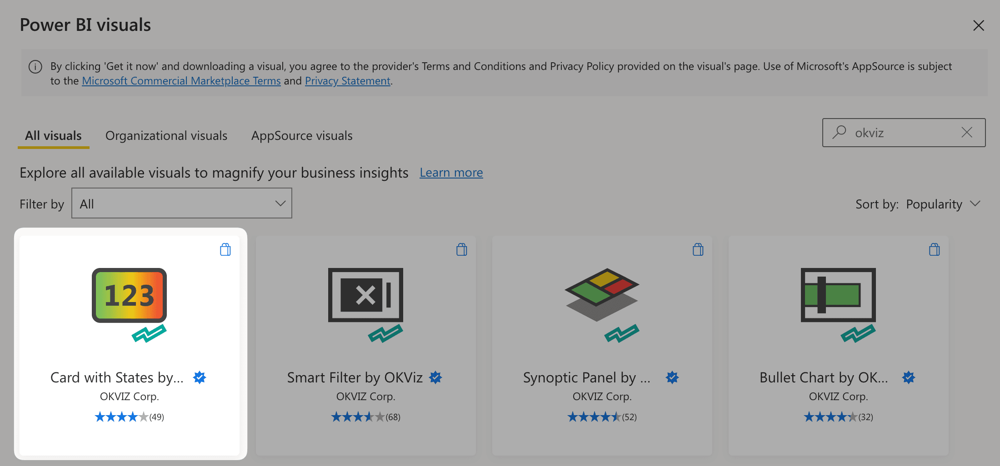
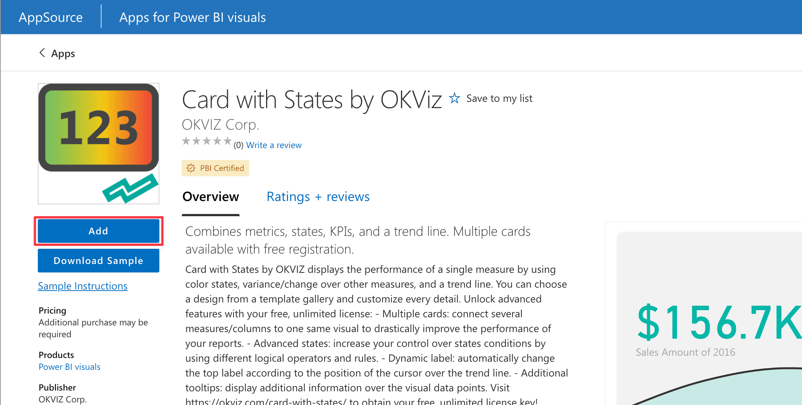
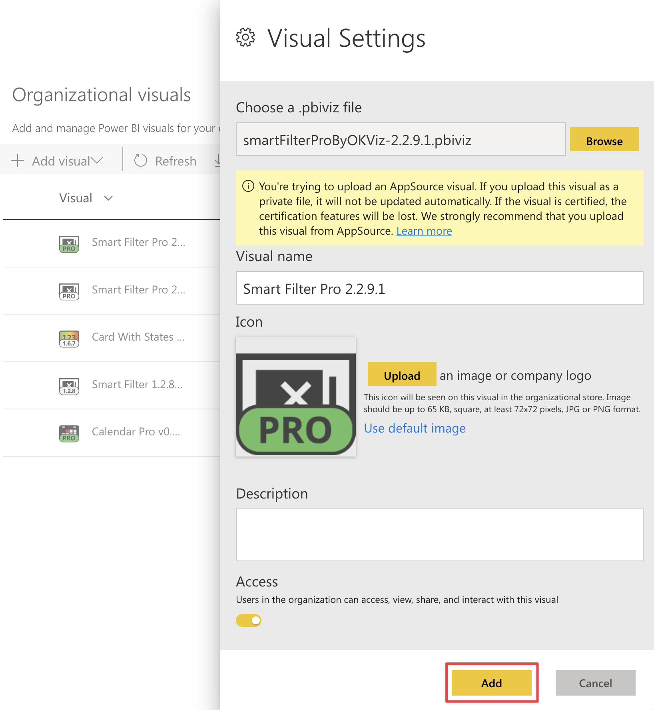
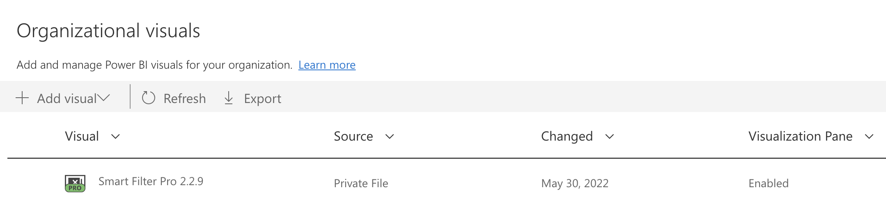
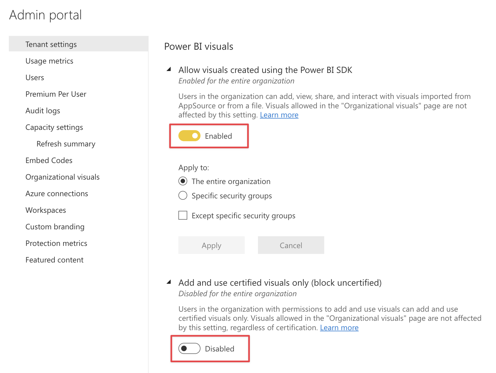
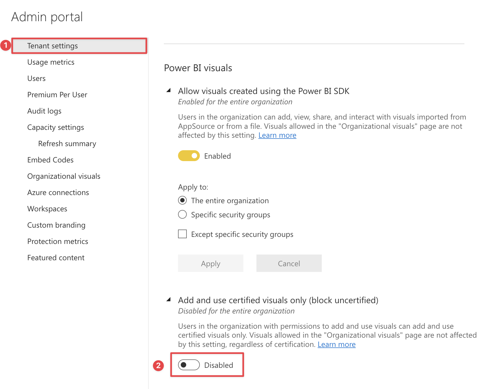

OKVIZ visuals (like any other custom visuals for Power BI) are wrapped as files with the ***.pbiviz*** extension. You cannot directly open .pbiviz files with Power BI. Instead, you must import them into your reports or install them in your organization marketplace by following one of the methods described below.

## From a File

You can use custom visuals locally, even without access to an Internet connection or Power BI service.
To do so, you need to follow these steps:

1.	Open a report with Power BI Desktop or from the Power BI service.
2.	Select the ellipsis from the bottom of the ***Visualizations*** pane and choose ***Import a visual from a file*** from the dropdown menu.

    

4.	From the Open File dialog box, select the .pbiviz file to import and then select ***Open***. The icon for the custom visual is added to the bottom of your ***Visualizations*** pane.

    

5.	Click on the new icon and start using the visual.

## From the AppSource

The easiest way to load a custom visual into your reports is through the AppSource. AppSource is the marketplace provided by Microsoft that includes all public visuals from different vendors and is reachable directly in Power BI.
To use it, follow these steps:

1.	Open a report with Power BI Desktop or from the Power BI service.
2.	Select the ellipsis from the bottom of the ***Visualizations*** pane and choose ***Get more visuals*** from the dropdown menu.

    

4.	From the dialog box, search for the visual you want to install, click on it and press ***Add*** in the next screen.

    

    

5.	Click on the new icon in the ***Visualizations*** pane and start using the visual.

> **Smart Filter Pro**: The benefit of using AppSource is that **every new version of Smart Filter Pro is automatically downloaded and applied** to each of your reports. Unfortunately, **this is also a drawback** as you do not have control over the version of the visual in use and cannot downgrade to an older version in case of regressions. For this reason, we recommend that you install it as described in the next method.

## From the Org Store

The Power BI Organizational Store is a private marketplace used to store and share visuals within an organization. In order to use OKVIZ visuals in the Org Store, there are two steps required:

1.	[Installing a visual in the Org Store](#installing-a-visual-in-the-org-store)  
    This must be done by an admin every time a new version of the custom visual is released.

2.	[Importing a visual from the Org Store into your reports](#importing-a-visual-from-the-org-store-into-your-reports)  
    Any user in the organization can do that.

These steps are described in detail in the following sections.

> **Smart Filter Pro**:  We encourage you to install Smart Filter Pro in the Org Store in order to benefit from automatic updates and timely support. More information here: [Power BI Organizational Store](org-store.md)

### 1. Installing a visual in the Org Store

Power BI admins can deploy custom visuals throughout their organization. This way, any user creating a report can easily discover and use them. To install a new custom visual in the Org Store:

1.	Log into your Power BI account and navigate to ***Admin portal***.

    

2.	In the ***Organizational visuals*** tab, select ***Add visual***, then ***From a file***.

    

3.	In the panel that appears on the right, click the ***Browse*** button, choose the custom visual to import and give it a name – you can simply copy the actual name of the custom visual. Press ***Add***.

    

4.	The visual is now installed correctly.

    

5.	Enable custom visuals within your organization.

    Go to ***Tenant settings*** and make sure that:

    - ***Allow visuals created using the Power BI SDK*** is enabled; 
    - ***Add and use certified visuals only (block uncertified)*** is disabled.

    > **Smart Filter Pro**: The latter is required by Smart Filter Pro only as it is uncertified.   
    Find out why we did not apply for certification here: [Smart Filter Pro Certification](../smart-filter-pro/features/certification.md)

    

### 2. Importing a visual from the Org Store

To use a custom visual stored in the Org Store:

1.	Open a report with Power BI Desktop or from the Power BI service.
2.	Select the ellipsis from the bottom of the ***Visualizations*** pane and choose ***Get more visuals***.

    

3.	Select ***Organization visuals*** from the top tab menu. Choose the visual to import and press ***Get it now***.

    

4.	The icon for the custom visual is added to the bottom of your ***Visualizations*** pane and is now available for use in your report.

    

> Visuals stored in the Org Store are only available within your organization. If you plan to share a report with a visual from your Org Store externally, you need to replace it with a local file, othwerwise it will not available to your recipients and [they will see an error](../issues/common-issues.md#the-visual-is-no-longer-available-please-contact-your-administrator-for-details).

Next reading:

- [How to Use Visuals](how-to-use.md)