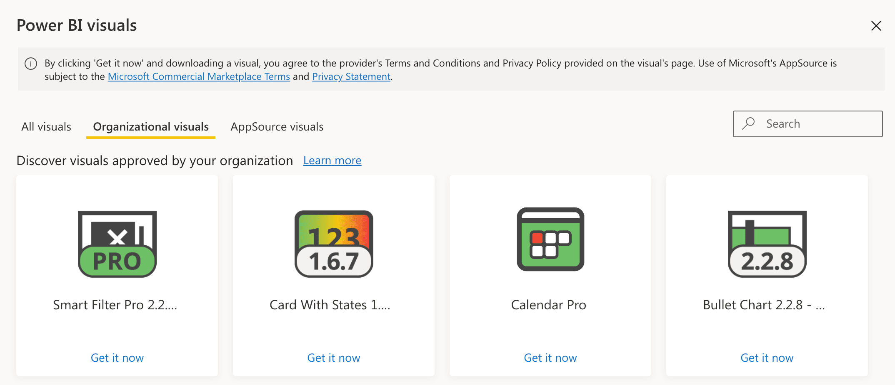

The Power BI Organizational Store is the best way to share custom visuals within your organization. This is especially useful for custom visuals not available in the public marketplace (AppSource). The Org Store is automatically included in your Power BI Pro license and the visuals stored there can be used both from Power BI Desktop and service.

> To manage the Org Store you need to be a Power BI administrator, but everyone in your organization can use visuals stored there without special rights. Find out more here: [Using organization custom visuals in Power BI](https://docs.microsoft.com/en-us/power-bi/developer/visuals/power-bi-custom-visuals-organization)

There are two main benefits in using the Org Store:

- [Automatic Updates](#automatic-updates)
- [Timely Support for Private Visuals](#timely-support-for-private-visuals)

## Automatic Updates

Custom visuals are pieces of software, and like any other software they need updates. These updates could fix bugs, support changes in the Power BI core, or introduce new features.

**When using a custom visual that does not come from the public marketplace, you are potentially in trouble.** In fact, any new update of that visual will require some action on your part in every report using that visual. If you have one or two reports, the update effort is minimal. However, if you use a custom visual in many reports, manually updating the custom visual in every single report file can represent an inefficient use of your time.

By storing custom visuals in the Org Store, you can import custom visuals from there when you design a report to make sure any future update will be automated. **Every new release only requires a single update of the custom visual in the Org Store**. Every report will be automatically updated, including both reports published on Power BI services and local reports.

The Org Store can also be used with visuals from the AppSource. In this case, the benefits are less obvious, as every visual from the AppSource is already automatically updated in every report. Actually, the Org Store gives Power BI administrators the ability to decide when to update and test new versions before deployment.

## Timely Support for Private Visuals

Releasing custom visuals to the AppSource requires a Microsoft review process that typically takes up to 3 weeks. This is good for checking regressions, but not so good for existing bug fixes that may be urgent for a specific report.

By using the Org Store, you are in control of any update. Indeed, if there is a critical bug in one of the visuals you are using, you can quickly apply a patch to every report on the very day the update is available. This way, you are not dependent on Microsoft’s timeline for releasing the custom visual on to the marketplace.

Unfortunately, **this is only true for private, uncertified visuals.** This is because a visual must be reviewed, approved and released in AppSource to be certified, which brings us back to the 3-week process.

> Find out more on certification here: [Certification](../get-started/certification.md)

## How to Manage Visuals in the Org Store

The installation of custom visuals in the Org Store is described here: [Installing from the Org Store](installation.md#from-the-org-store)

Updating an existing visual in the Org Store is covered here: [Updating from the Org Store](updating.md#from-the-org-store)