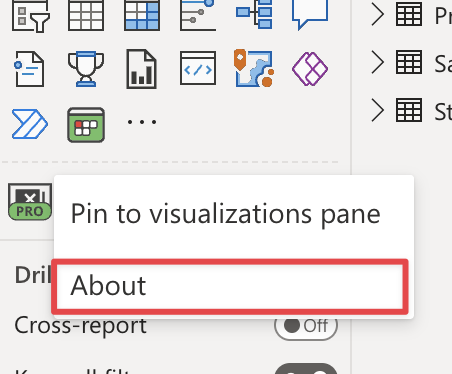
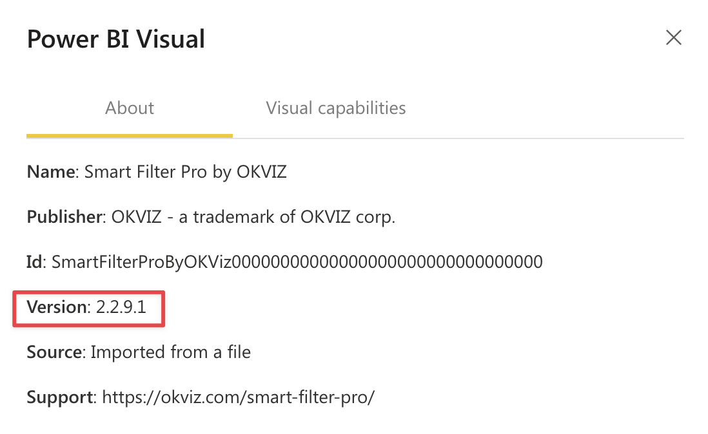
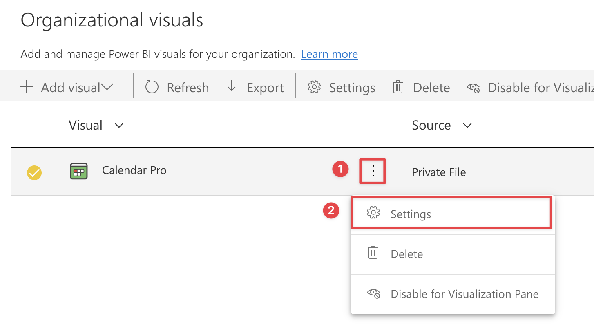

Keeping code updated is an essential part of our committment. This is the only way to get rid of bugs and take advantage of the latest features of Power BI.  
From a user's perspective, updating a visual to a new version is a simple operation, but it requires different steps based on how visuals have been installed.

## From a File

The updating process of a local visual file is almost identical to its installation:

1.	Open a report with Power BI Desktop or from the Power BI service.
2.	Select the ellipsis from the bottom of the ***Visualizations*** pane and choose ***Import a visual from a file*** from the dropdown menu.

    

3.	From the Open File dialog box, select the .pbiviz file to import and then select ***Open***. At this point the visual will be updated. You can check this by right-clicking on the visual in the ***Visualizations*** pane and choosing ***About***.

     
    

## From the AppSource

If the visual has been installed on AppSource, no additional actions are required to keep it up to date. In fact, every new version of the visual is automatically downloaded in every report that uses a previous version.

This behavior is straightforth and time-saving, but since **it doesn't show any notification when a new version is updated in your reports (and you cannot downgrade it at any time)** you may run into problems if a regression or new default settings cause a sudden change in the report layout. It is our duty to avoid these scenarios, but they actually happen.

## From the Org Store

When a new version of a custom visual installed in the Org Store is released, Power BI admins can automatically **update all the reports using that visual throughout the organization**.
To update an existing visual in the Org Store:

1.	Log into your Power BI account and navigate to [Admin portal](https://app.powerbi.com/admin-portal/).

    

2.	In the ***Organization visuals*** tab, select the custom visual to upgrade and click on the gear icon (***Settings***).

    

3.	Click ***Browse*** and choose the new version of the custom visual that will be uploaded to the Org Store. Press ***Update*** to save.

    