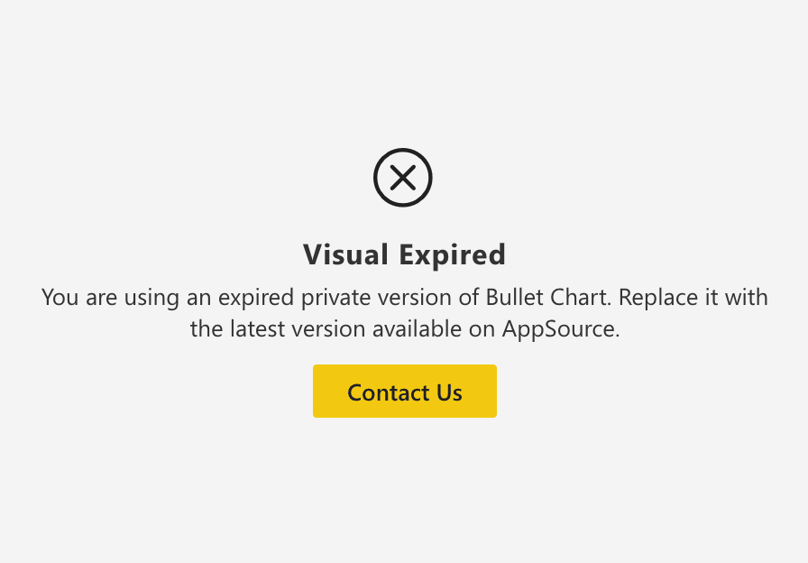

Custom visuals published on AppSource go through a review and approval process by Microsoft that can take up to 3 weeks (depending on several factors - see [Issues](index.md)). For this reason, when a new version of a visual introduces a regression that affects more users, **we may provide fixed preview versions** to our users.

These types of versions are almost identical to published versions, but with some limitations:

* ### Uncertified

    Preview versions cannot be certified ([Certification](../get-started/certification.md)). This does not mean that we steal your data or that they contain unsafe code, but just that, since we want to distribute them before the Microsoft certification process, they do not have enough time to complete it. Indeed, **we send the same version to Microsoft at the exact time we release it as a preview.**

* ### Expiration

    Preview versions have an expiration date, usually 5 weeks from their ditribution. After the expiration date they will stop working showing a warning message like this:

    

* ### Actions required

    Preview versions have a different internal id than published versions. **This causes them not to be updated automatically** like versions from AppSource. You must manually install them in reports at the beginning, and update them at the expiration in each report that use them (unfortunately, the [Org Store](../get-started/org-store.md) is not useful in this case). 

 

You can identify a preview version by looking at the ***About*** section of the visual and by its icon, which includes the version number on a yellow background:

   

