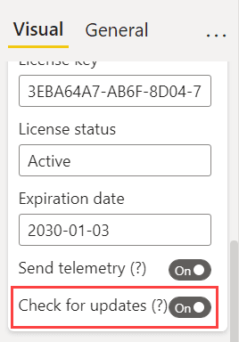

**Default value:** On

Power BI frequently receives updates and thus, custom visuals must interact with this evolving platform synchronously. Updates might be required not only when a user might be interested in new features, but also to guarantee existing features. Bug fixes and updates required to support new versions of Power BI are the two main reasons why keeping the custom visuals up-to-date is important.

> See how to update OKVIZ visuals here: [Updating OKVIZ Custom Visuals](../../general/updating.md)

Smart Filter Pro sends out notifications about new versions if the **Check for Updates** setting is enabled. It checks if there is a new version of the visual and displays a message when the report is in [Editing view](../../general/interactive-modes.md). In any case, a notification email about a new version available is sent to the user who registers Smart Filter Pro, including a link for the direct download. Just like [Send telemetry](#send-telemetry) setting, this setting will also not work in case you do not have a working Internet connection.
 

The **Check for updates** setting is beneficial for users who manually download and update the licensed custom visual. While for the users who installed Smart Filter Pro from the Microsoft Store, the updates are automatic. The frequency for the release of updates is no more than 1 per month. 