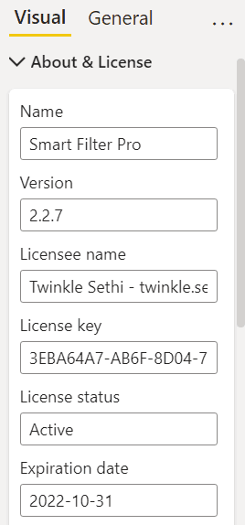

This properties group displays the name and version of the visual, licensing details, and options related to deployment and updates.

Licensing details in this section include the below fields:

-	**Licensee name**: Registered user name
-	**License key**: Alphanumeric key that gives access to the licensed version of visual
-	**License status**: Active/Expired *(read-only)*
-	**Expiration date**: Expiry of subscription *(read-only)*

The license for Smart Filter Pro follows a subscription-based model. There are different plans available depending on the type of Power BI license used. 

The behavior of Smart Filter Pro is different when downloaded from the AppSource marketplace or our website: 
 - **When downloaded from the AppSource**, you need to explicitly write the license details every time you add a visual to a report.
 - **When downloaded from your account dashboard on the OKVIZ website**, the license details are hardcoded in the visual package and the above fields are read-only, so you can use the visual freely without the need to provide any other information.

> More information about licensing can be found here: [Licensing](../../general/licensing.md)

The other options in this section are:
- [Check for Updates](check-for-updates.md)
- [Send Telemetry](send-telemetry.md)

