  
The *Appearance* properties group has features related to appearance of the visual items. Some features in this section are available for all the modes, while some are only available and relevant to some specific modes. Most of the features in the *Appearance* properties group are related to font and colour of the visual items.  

Let us have a look at the features in this properties group for each mode one by one:  

## Dropdown Mode  

### Dropdown Back Color  

This feature represents the background color of the dropdown.  

   

The dropdown back color has been purposely changed from white to light grey for clear illustration.  

### Items Back Color  

This feature represents the background color of the item selected for filter.   

    

### Items Text Color  

This feature represents the font color of the item selected for filter.   

   

You see here that the font of the selected item is white against blue background.    

### Input Color  

This feature represents the font color of the input item before selection. As soon as the user presses the Enter key, filter is applied and the color of the item changes to item text color.  

    

### Input Back Color  

This feature represents the background color of the input textbox.    

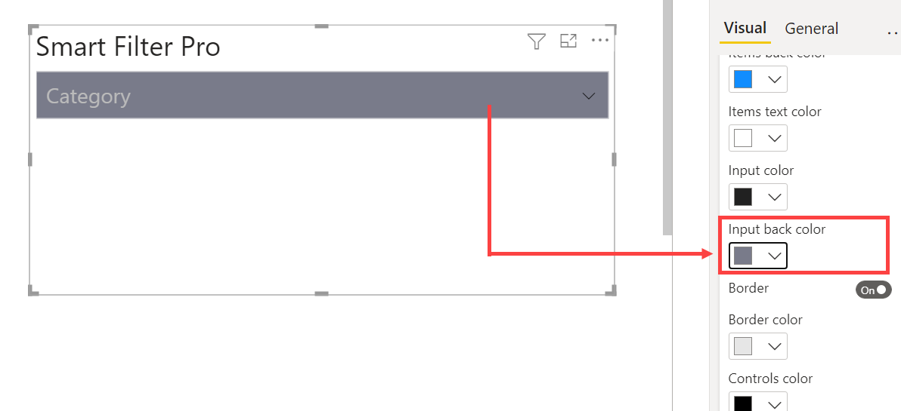  

The input back color has been purposely changed from white to dark grey for clear illustration.  

### Border  

This feature if enabled, draws a border outline for the input textbox.  

  

### Border Color  

This feature represents the border color of the input textbox.  

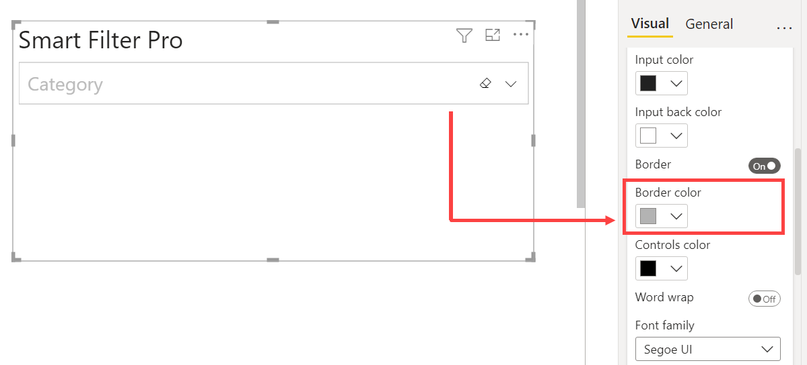   

## Controls Color  

This feature represents the color of the dropdown control – the arrow in the right corner of input textbox used for expanding the dropdown list.  

   

### Word Wrap  

The word-wrap feature allows long words to be able to be broken and *wrap* onto the next line. It is a word processing feature that automatically transfers a word for which there is insufficient space from the end of one line of text to the beginning of the next.  

   

As you can see in the example above that the category item *Music, Movies and Audio Books* is not completely visible due to less width of the visual. However, if you switch on the *Word wrap* feature, then the invisible text will be wrapped onto the next line.  

    

### Font Family  

This feature represents the font style of the items selected for filter in input textbox.  

    

### Text Size  

This feature represents the font size of the items’ text.  

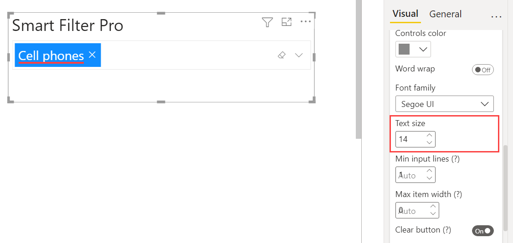   

### Min Input Lines  

This feature is used to set the minimum height of the input textbox. It is set to 0 so as to automatically fill the size/height of the visual.   

For instance, if you select multiple subcategory items for filter, then the *Min input lines* feature will accordingly adjust and increase the height of the input textbox so as to accommodate all the item selections.  

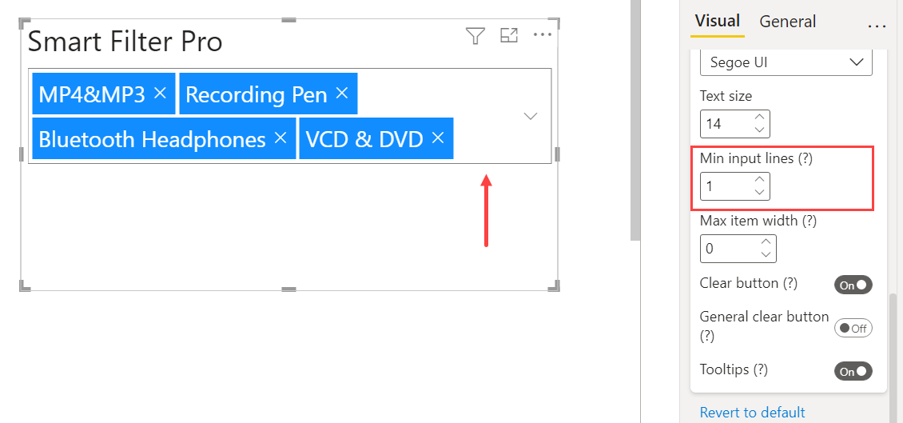   

If the value is set to 0, then the height of the input textbox will fill the entire visual.  

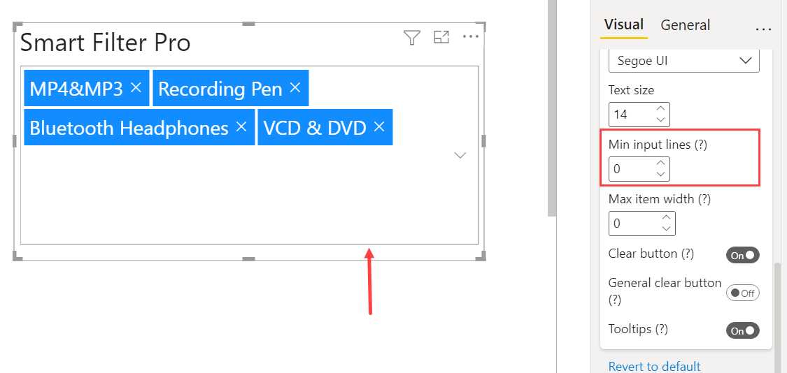   

Here you see that the height of the input textbox has filled the entire visual.  

### Max Item Width  

This feature is used to set the maximum width of each selected items. It is set to 0 so as to automatically use all the required space.   

   

If the value is set to 0, then it will automatically use all the required space.   

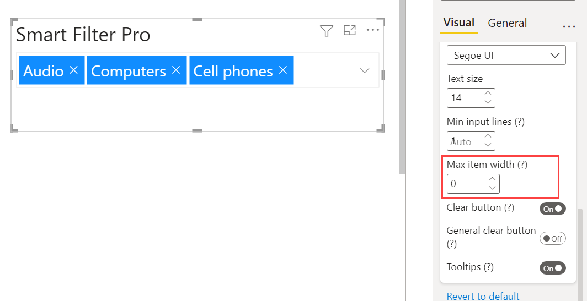   

### Clear Button  

This option, if enabled,  displays a button inside all the selected input fields so as to clear all of the content/selected items in one go. This button is hidden and is visible only when you hover over the input box.  

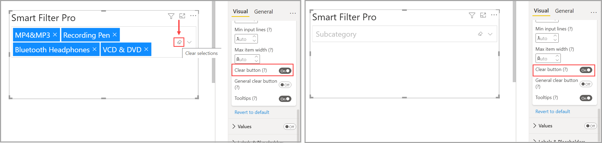    

In case, there is more than one input field in Smart Filter Pro, then the *Clear button* will be available in all the input boxes.  

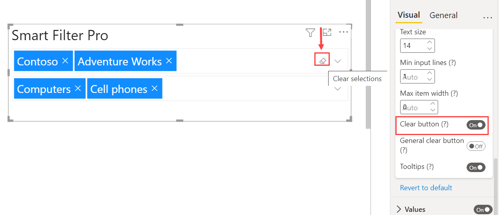    

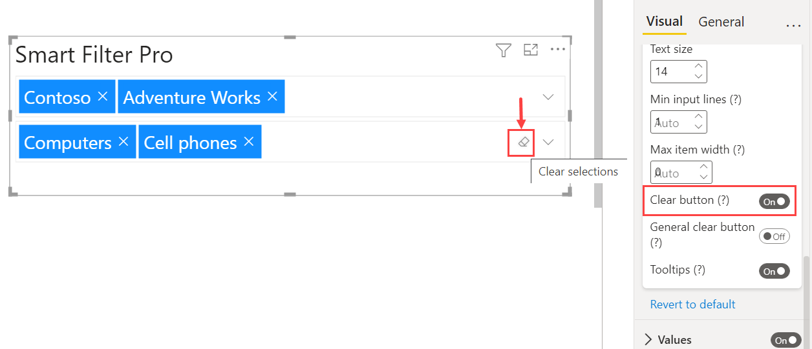    

So, when you click on all the *Clear buttons* of all the input boxes, then all the selected items of all the fields will be cleared.  

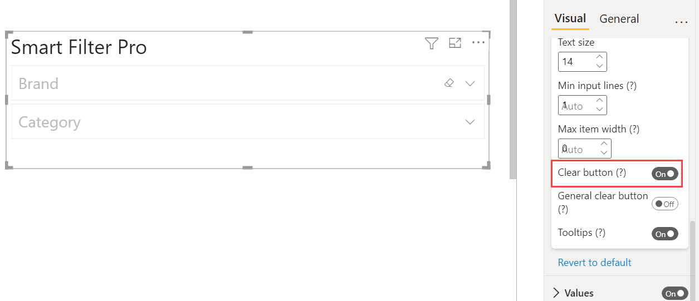  

### General Clear Button  

This option, if enabled, displays a button inside the visual, but out of the input box so as to allow to clear the contents of all input fields in general. This makes more sense when there are multiple fields in Smart Filter Pro, and you do not have to click on individual clear buttons in each input box to clear all the selections of all the fields. This button is also hidden and is visible only when you hover over the extreme right end of the visual.  

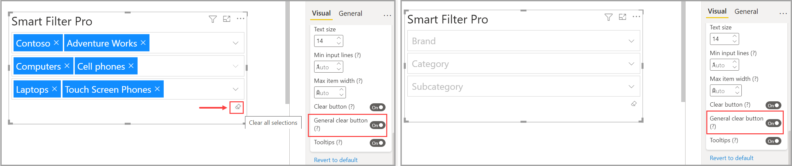   

### Tooltips  

Smart Filter Pro connects multiple fields and measures to the *Tooltips* field so as to display additional information for selected keywords. These additional fields are added to the *Tooltips* Fields area and are displayed on hovering over the visual. This feature is available only in Dropdown and Observer modes.  

    

    

## Filter Mode  

### Items Back Color  

[Items back color](#items-back-color)    

### Items Text Color  

[Items text color](#items-text-color)  

### Input Color  

[Input color](#input-color)  

### Input Back Color  

[Input back color](#input-back-color)  

### Border 

[Border](#border)  

### Border Color  

[Border color](#border-color)  

### Controls Color  

[Controls color](#controls-color)  

### Word Wrap  

[Word wrap](#word-wrap)  

### Font Family  

[Font family](#font-family)  

### Text Size 

[Text size](#text-size)  

### Min Input Lines  

[Min input lines](#min-input-lines)  

### Max Item Width  

[Max item width](#max-item-width)  

### Filter Button   

This feature, if enabled, shows a button inside the input box to apply the filter. In case this feature is not enabled – the button is hidden and the user can apply filter normally by pressing the Enter key in case of Filter mode, or CTRL + Enter in case of Search mode.  

  

On clicking this button, filter will be applied on the selected item without the need to press Enter Key.    

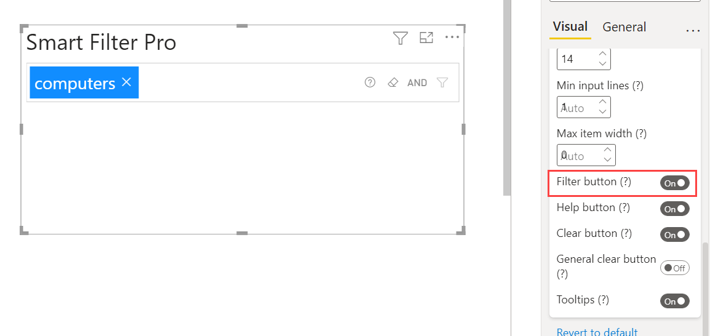   

Since the filter has been applied now, so the filter button gets greyed out.  

### Help Button  

This feature, if enabled, shows a button inside the input box to display a tooltip containing the available query syntax as per the field in the input box – numeric/textual/date. The button is hidden and is visible only when you hover over the input box.  

    

### Clear Button

[Clear button](#clear-button)  

### General Clear Button

[General clear button](#general-clear-button)  

### Tooltips

[Tooltips](#tooltips)  

## Search Mode  

### Input Color

[Input color](#input-color)   

### Input Back Color

[Input back color](#input-back-color)   

### Border

[Border](#border)   

### Border Color

[Border color](#border-color)   

### Controls Color

[Controls color](#controls-color)   

### Font Family

[Font family](#font-family)   

### Text Size

[Text size](#text-size)   

### Filter Button

[Filter button](#filter-button)  

### Clear Button

[Clear button](#clear-button)   

## Observer Mode    

### Items Back Color  

[Items back color](#items-back-color)   

### Items Text Color  

[Items text color](#items-text-color) 

### Input Color

[Input color](#input-color)   

### Input Back Color

[Input back color](#input-back-color)   

### Border

[Border](#border)   

### Border Color

[Border color](#border-color)   

### Controls Color

[Controls color](#controls-color)    

### Word Wrap  

[Word wrap](#word-wrap) 

### Font Family

[Font family](#font-family)   

### Text Size

[Text size](#text-size)   

### Max Item Width

[Max item width](#max-item-width)  

### Tooltips

[Tooltips](#tooltips)  

## Hierarchy Mode  

### Node Text Color  

This feature represents the font color of the node items.   

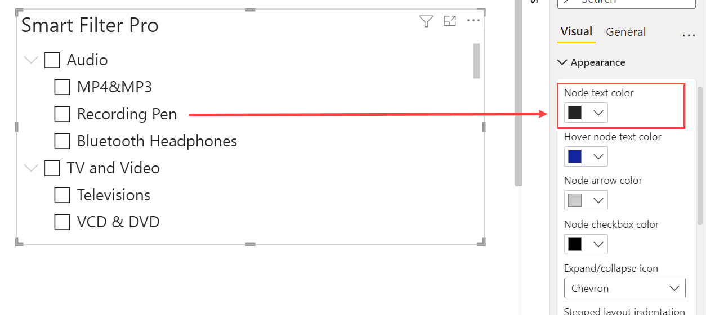    

### Hover Node Text Color  

This feature represents the font color of the node item that you hover over.  

    

### Node Arrow Color  

This feature represents the color of the icon – the node arrow which is used to expand/collapse the nodes when there is more than one field/column in the visual displaying parent category and sub categories.   

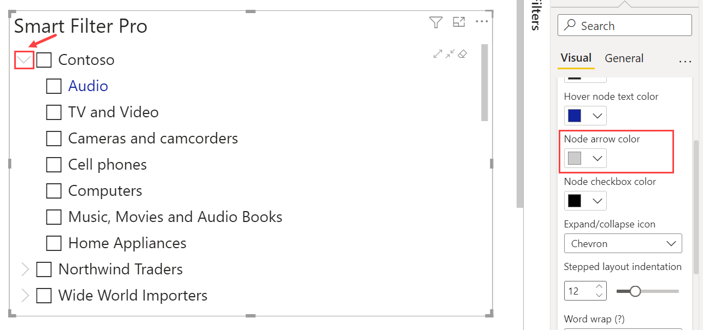   

### Node Checkbox Color  

This feature represents the checkbox color of the node item.   

    

### Expand/Collapse Icon  

This feature represents the appearance of the icon used for expanding/collapsing the nodes when there is more than one field/column in the visual displaying parent category and sub categories. It provides three options to choose from – *Chevron*, *Plus/Minus*, *Caret*.   

Let us see how is the visual appearance on selecting each of these options:   

- **Chevron**: This displays an arrow button for expanding/collapsing the nodes. When the parent category is expanded to show the subcategories as well, then the arrow appears as a downward facing arrow. However, if the parent category is not expanded, then the arrow appears pointing to right.    

   

- **Plus/Minus**: This displays a plus/minus button for expanding/collapsing the nodes. When the parent category is expanded to show the subcategories as well, then the button appears as a minus button. However, if the parent category is not expanded, then the button appears as a plus button.  

   

-- **Caret**: This displays a button in the form of small triangle for expanding/collapsing the nodes. When the parent category is expanded to show the subcategories as well, then the triangle appears as a downward facing triangle towards right. However, if the parent category is not expanded, then the triangle appears pointing to right.  

   

### Stepped Layout Indentation  

This feature is used to choose the value for indentation where the subcategories are indented in a progression underneath the parent category.  

For instance, if you choose this value to be a very low number say 3, then the subcategories in the visual dropdown will be placed almost right under the parent category.  

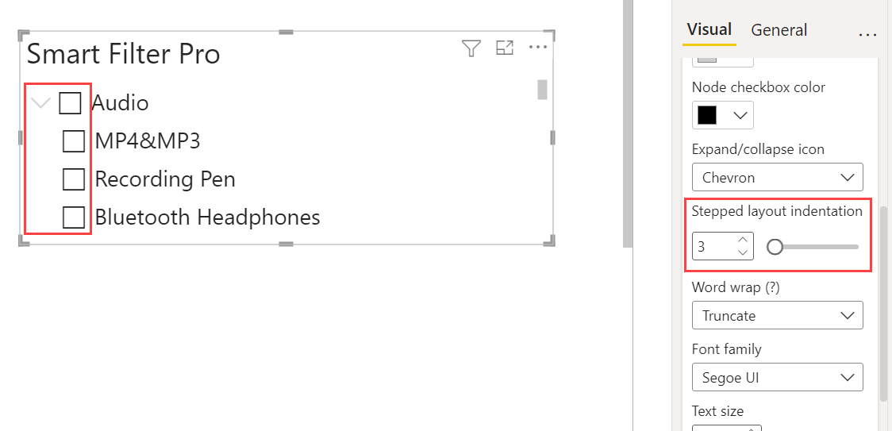   

So, you can see that the subcategories for *Audio* are not indented well and placed almost right under the parent category *Audio*. Keeping a low number for indentation gives the appearance of child subcategories at same level as the parent.

Now if you choose this value to be 20 say, then the subcategories will be indented in a progression underneath the parent category.  

   

So, you see that the subcategories for *Audio* are indented in a progression underneath the parent category *Audio*. Thus, the subcategories are displayed properly as child of parent category *Audio*.  

### Tree Controls  

This feature is used to show a bar with additional controls that allow to expand/collapse the nodes, and clear selections using buttons. These additional buttons are visible only when you hover over the input box.  

   

For instance, let us say you have the fields Category and Subcategory in Smart Filter Pro, and all of the parent categories are collapsed in the visual. Now if you wish to display all the subcategories of each parent category, then you can use the expand button to expand all the parent nodes in one go.    

    

So, when you click on the *Expand all* nodes button, then all the parent nodes get expanded in one go to show the subcategories as well.  

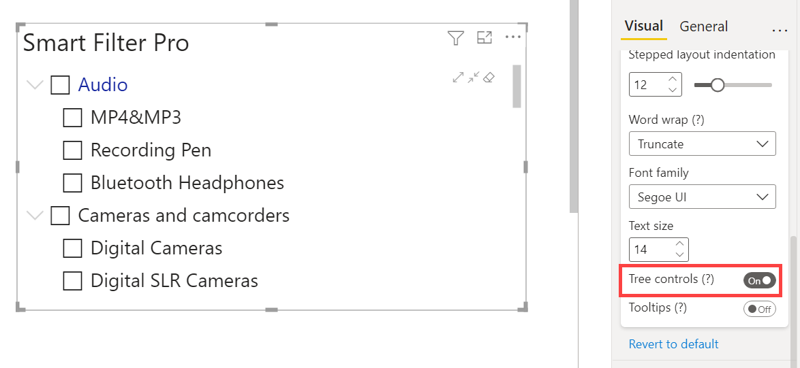    

Similarly, if you wish to collapse all the nodes in ne go, then you can use the *Collapse all* nodes button to display only the parent categories.  

    

So, when you click on the *Collapse all* nodes button, then all the parent nodes get collapsed in one go.  

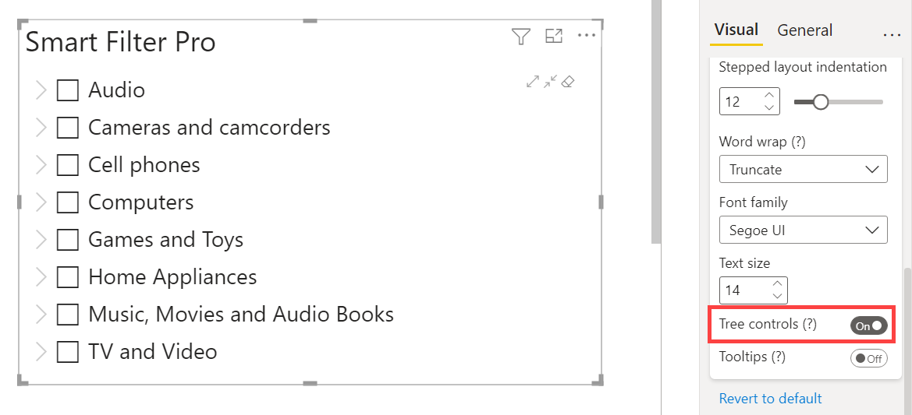    

The extreme right button on enabling the *Tree controls* feature is the button used for clearing all the selections. Suppose the categories *Computers* and *Cell phones* are selected for filter.  

     

Now the moment you click on the *Clear selections* button, the selected items will be cleared and you will see the list of items without any application of filter.  

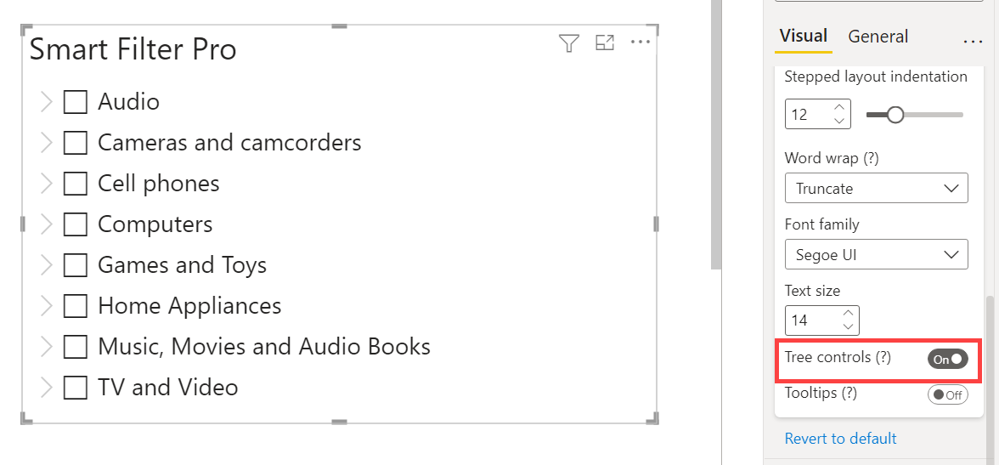   

### Tooltips  

[Tooltips](#tooltips)

