  
The Appearance properties group contains options related to the appearance of Smart Filter Pro. 

Let us have a look at these options one by one:  

## Border  

All modes except Hierarchy

**Default value:** On

This option, if enabled, draws a border outline for the input textbox or field area.  

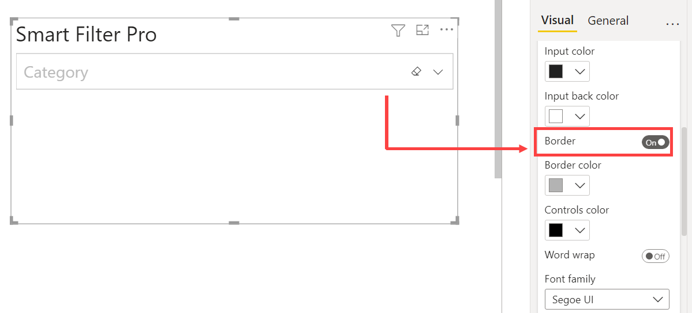  

## Border Color  

All modes except Hierarchy

This option defines the border color of the input textbox.  

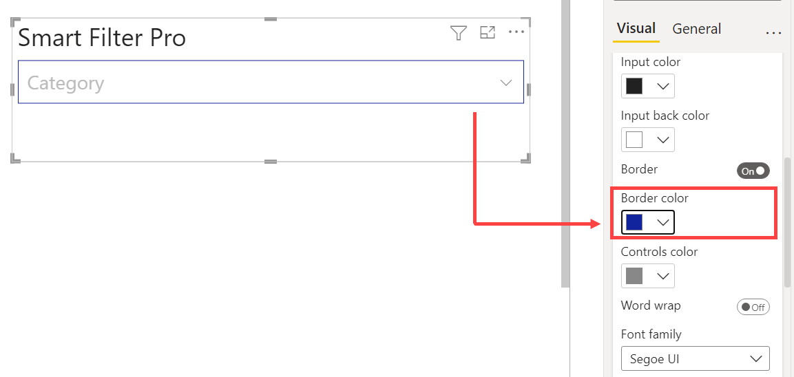

## Clear Button  

Dropdown | Filter | Search mode

**Default value:** On

This option, if enabled, displays a button inside every input control so as to clear all of the content/selected items in one go. This button is hidden and is visible only when you hover over the input box. 

    

## Controls Color  

All modes except Hierarchy

This option defines the color of the interface controls of the visual, such as the dropdown arrow in Dropdown mode, the help button in Filter mode and so on.

   

## Dropdown Back Color  

Dropdown mode

This option defines the background color of the dropdown list.  

   

## Expand/Collapse Icon  

Hierarchy mode

**Default value:** Chevron

This option defines the appearance of the icon used for expanding/collapsing the nodes in a hierarchy tree. It provides three options to choose from:

- **Chevron**: This displays an arrow button for expanding/collapsing the nodes  

       

- **Plus/Minus**: This displays a plus/minus button for expanding/collapsing the nodes  

       

- **Caret**: This displays a button in the form of small triangle for expanding/collapsing the nodes.

       

## Filter Button   

Filter | Search mode

**Default value:** On

This option, if enabled, shows a button inside the input controls to apply the filter. In case this option is not enabled, the button is hidden and you can apply the filter by pressing the Enter key with Filter mode, or CTRL + Enter (Cmd + Enter on Mac) with Search mode.  

  

## Font Family  

This option defines the font style of the filter items of the visual.  

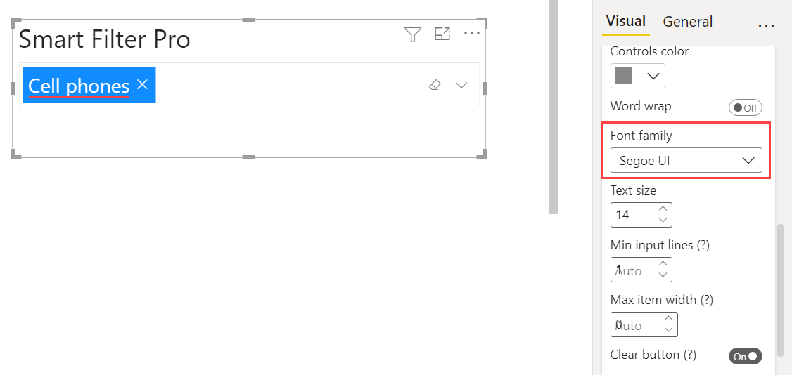    

## General Clear Button  

Dropdown | Filter mode

**Default value:** Off

This option, if enabled, displays a button to clear the contents of all input fields at the same time. This makes more sense when there are multiple fields connected to the visual, and you do not want to click on individual [clear buttons](#clear-button) in each input box to empty it. This button is visible only when you hover over the extreme right end of the visual.  

   

## Help Button  

Filter mode

**Default value:** On

This option, if enabled, shows a button inside the input box to display a tooltip containing the available [query syntax](mode/filter#how-to-search) as per the field of the input box. The button is hidden and is visible only when you hover over the input box.  

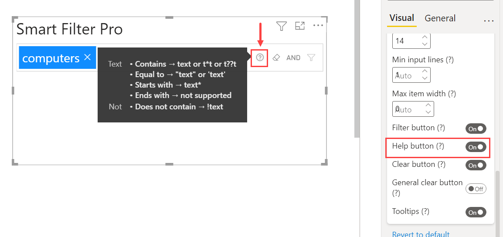    

## Horizontal

Dropdown | Observer mode

**Default value:** Off

This option defines the arrangement of the input controls when multiple fields are connected to the visual. If enabled, the controls are aligned horizontally, otherwise each control is positionated below the others.

   

 

## Input Back Color  

All modes except Hierarchy

This option defines the background color of the input textbox.    

  

The input back color has been purposely changed from white to dark grey for clear illustration.  

## Input Color  

All modes except Hierarchy

This option defines the font color of the input textbox. The color of the filter items is defined by a [different option](#items-text-color).  

    

## Items Back Color  

Dropdown | Filter | Observer mode

This option defines the background color of the filter elements in the visual.   

    

## Items Text Color  

Dropdown | Filter | Observer mode

This option defines the font color of the filter elements in the visual.   

   

## Max Item Width  

Dropdown | Filter | Observer mode

**Default value:** 0

This option is used to set the maximum width of each filter items. 

   

> Set ***Max Item Width*** to 0 to automatically use all the required space.   

## Min Input Lines  

Dropdown | Filter mode

**Default value:** 1

This option is used to set the minimum height of the input textbox.

As you select multiple elements, the height of the visual automatically increases to accommodate the selection. Setting a value greater than 1 here forces the visual to be a specific number of lines tall. For example, if the elements you select span 2 lines and you put 3 as a minimum, the visual height will be 3 lines. However, if the elements span 4 lines, the height of the visual will be 4 lines.

<todo assign="daniele">Retake two screenshot spanning 2 and 4 lines.</todo>

> Set ***Min Input Lines*** to 0 to automatically fill the height of the visual.   

## Node Arrow Color  

Hierarchy mode

This option defines the color of the arrow icon used to expand/collapse the hierarchy tree nodes.  

  

## Node Checkbox Color  

Hierarchy mode

This option defines the checkbox color of the tree node items.   

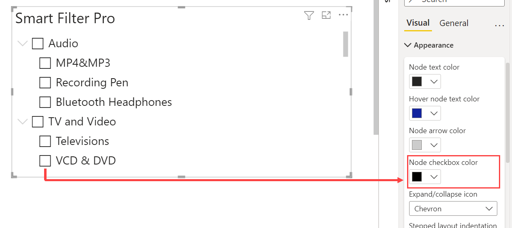    

## Node Text Color  

Hierarchy mode

This option defines the font color of the tree node items.   

    

## Node Text Color (Hover)

Hierarchy mode

This option defines the font color of the tree node items on hover.  

    

## Stepped Layout Indentation  

Hierarchy mode

**Default value:** 10

This option is used to choose the value for indentation where the subnodes are indented in a progression underneath the parent node in a hierarchy tree.  

For instance, if you choose this value to be a very low number say 3, then the subcategories in the visual dropdown will be placed almost right under the parent category.  

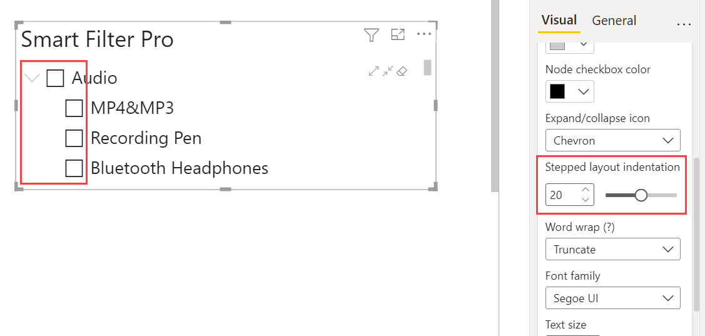   

## Text Size  

This option defines the font size of the items.  

   

## Tooltips  

All modes except Search

**Default value:** On

Enable this option to display additional information in the tooltips of each filter item of the visual.

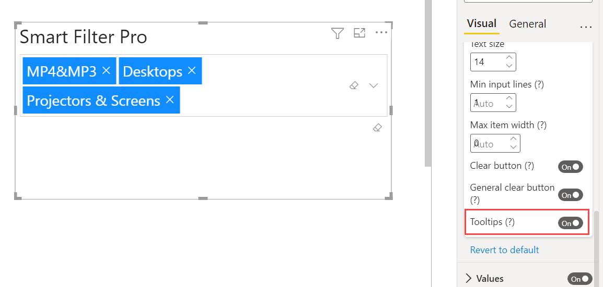    

You can enrich the content of the toolips by connecting different measures to the ***Tooltips*** field of the visual.

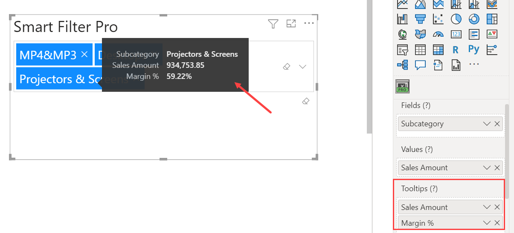 

> For more information, see this article: [Customize tooltips in Power BI](https://docs.microsoft.com/en-us/power-bi/create-reports/desktop-custom-tooltips)

   

## Tree Controls  

Hierarchy mode

**Default value:** On

This option is used to show a toolbar with controls to expand/collapse the nodes, and clear the current selection in a tree. This toolbar is visible only on hover.  

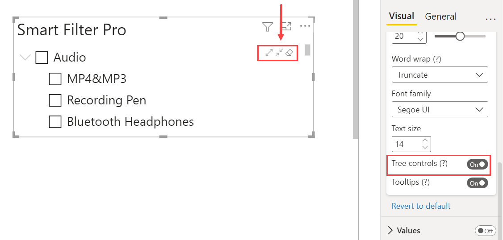   

For instance, let us say you have the fields ***Category*** and ***Subcategory***, and all of the parent categories are collapsed in the visual. Now if you wish to display all the subcategories of each parent category, then you can use the expand button to expand all the parent nodes in one go.    

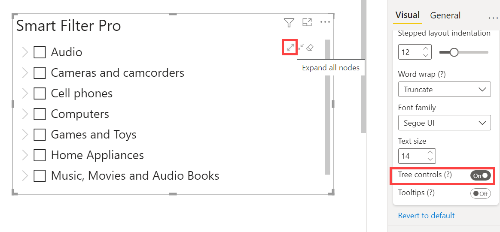    

Similarly, if you wish to collapse all the nodes in one go, then you can use the ***Collapse all*** button to display only the parent categories.  

    

The last button on the the right is used for clearing all the selections.

   

## Word Wrap  

Dropdown | Filter | Observer mode

**Default value:** Off

The option allows you to break long words and wrap them in multiple lines. It is a word processing function that automatically transfers a word for which there is not enough space from the end of one line of text to the beginning of the next.

   

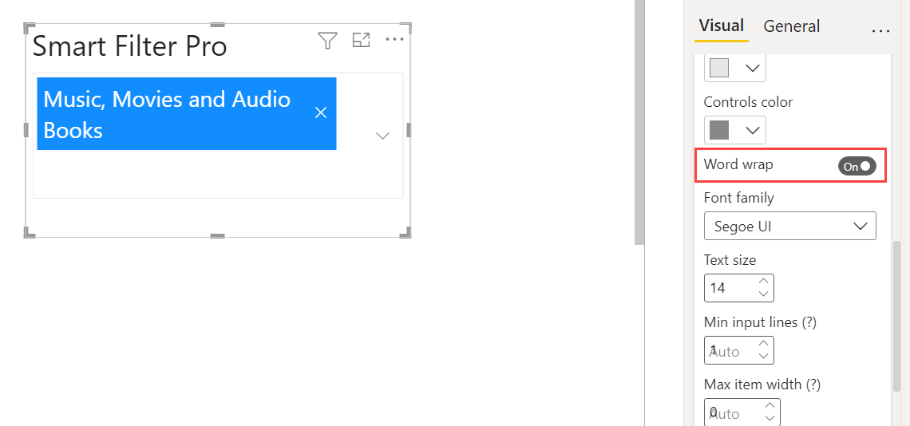   

## Word Wrap (Hierarchy)

Hierarchy mode

**Default value:** Truncate

The word-wrap option in Hierarchy mode allows you to choose how to display long node names in two ways:    

- **Truncate**: This truncates node names to keep them on one line and add the ellipsis at the end.   

    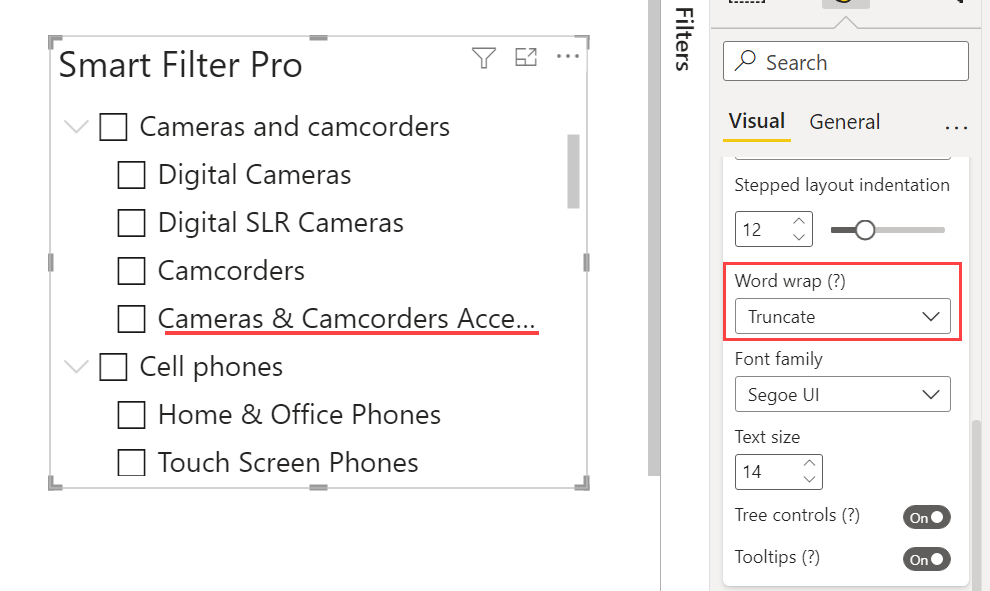  

- **Wrap**: This breaks node names across multiple lines in case the width of the visual is less than their length.  

       