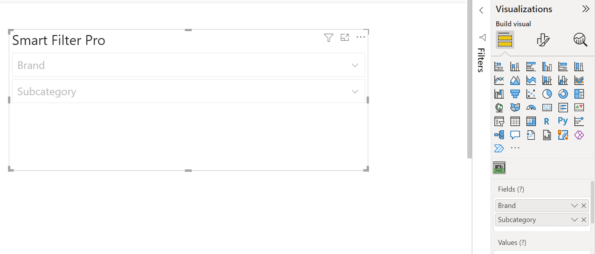
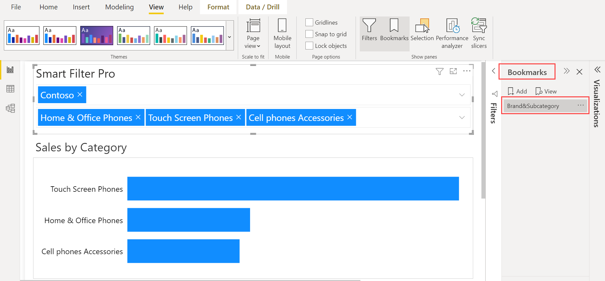
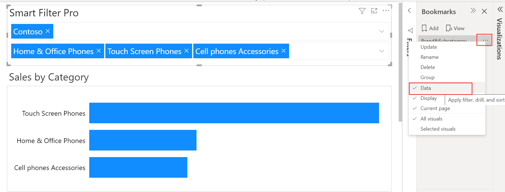

 The [Power BI Bookmarks](https://docs.microsoft.com/en-us/power-bi/create-reports/desktop-bookmarks) option allows you to capture the current state of a report page. Bookmarks save the current filters and slicers, cross-highlighted visuals, sort order, and so on. Smart Filter Pro also supports the ***Bookmarks*** feature of Power BI seamlessly.   

 In order to illustrate this option, suppose that you have ***Brand*** and ***Subcategory*** as the input fields in Smart Filter Pro on a particular report page.   

     

 Now you want this report page to always filter on some specific brand and subcategories whenever you open it. Thus, you can create a bookmark capturing filters of your preference in Smart Filter Pro. 
 
 Let us say you want to capture the state of visuals filtered by the Contoso brand, and some specific subcategories related to *Phone*. To do this, first apply the specific filters in Smart Filter Pro, and then create a bookmark using the ***Bookmarks*** button under the ***View*** tab. Click on ***Add*** and name it.  

    

 Even after you clear/change these filters, clicking on this bookmark every time will automatically change to the view that belonged to the bookmark. 

If you click on the three dots next to the bookmark, then a dropdown menu will appear that will have some pre-checked options. If the ***Data*** option is checked, then the current state of data within the filters, slicers, and all the visuals will also be captured, and each time you navigate to/click on this bookmark, you will see exactly the same state of data.   

  

