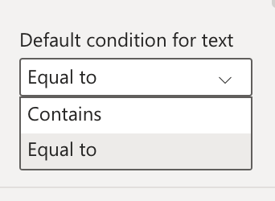

This page contains a quick summary of versions and notable changes of Smart Filter Pro.  
Smart Filter Pro uses **Power BI Custom Visuals API v1.13.0** - compatible with Power BI July 2018 and later versions.

## v2.2.9.1
**Released:** 2022-07-05

**Added:**
- Support for Power BI context menu.
- *Min item width* option.
- Tooltips for truncated text in dropdown list.

**Changed:**
- Extended *Empty when no selection* option to each mode.

**Fixed:**
- An issue with *Select all* with Hierarchy mode.
- An issue with license validation.

## v2.2.8
**Released:** 2022-03-20

**Changed:**
- Some options labels and tooltips.
- [Max Items in Dropdown](mode/max-items-in-dropdown.md) now can be 0 to include all results available in cache for the query string.
- Improved memory usage.

## v2.2.7
**Released:** 2021-10-21

**Fixed:**
- An issue with bookmarks in Observer Mode.

## v2.2.6
**Released:** 2021-09-15

**Added:**
- Max item width option.

**Fixed:**
- Auto-complete on Android mobile devices.
- Increased dropdown control area for mobile devices.
- Automatic color for values on mouse hover.
- Alignment in dropdown menu.
- Custom sorting.

## v2.2.5
**Released:** 2021-08-01

**Changed:**
- ***Filter other fields*** has been renamed to ***Cross Filtering***.

**Added:**
- [New cross filtering behaviors](mode/cross-filtering.md#cross-filtering-behavior) - The old behavior has been kept for backward compatibility but the default is now a corrected new version which fixes a few bugs that appeared in some scenarios. Also, a 'Sequential' behavior has been added: it can be used to filter other fields based on the order they appear in the visual.

**Fixed:**
- Custom sorting for numeric values

## v2.2.4
**Released:** 2021-07-15

**Added:**
- [New option to empty the whole report](mode/empty-when-no-selection.md) if no selection is set on the visual. It's useful to limit the number of data loaded at startup with huge datasets.

**Fixed:**
- Problems with boolean values in Observer mode.
- Problems with filters including Not (!) operator.

## v2.2.3
**Released:** 2021-03-30

**Added:**
- The ability to select multiple values in Observer mode without using CTRL.
- The ability to paste multiple values mapped to a specific field when you are in Filter mode with Consolidate fields enabled. E.g.: you can write FIELDNAME: and then paste multiple values to automatically apply the filter(s) to your report.
- The ability to sort by value.
- The ability to use the [Search mode](mode/search.md) with multiple fields. In this case the visual displays a select box you can use to choose the field to use.
- The ability to change the background color in Observer mode.

## v2.2.2
**Released:** 2020-11-15

**Added:**
- The ability to change the formatting culture code of the values in the filter.
- The ability to change the color of the dropdown and other controls.

## v2.2.1
**Released:** 2020-10-14

**Added:**
- The ability to connect a measure to [display its value](values) for each category in the filter (supported by Dropdown/Observer/Hierarchy modes).  
  
  

- A new option to change the text of the ***Select all*** button in Hierarchy mode.

**Fixed:**
- A fix to the position of ***Select all*** button.
- A fix for the control icons in Search mode.

## v2.2.0
**Released:** 2020-09-30

**Added:**
- [A new option](mode/compress-multiple.md) to control how many items must be displayed before compressing the field when you are in Dropdown mode and the Compress multiple items option is enabled.
- A few new options to control the appearance of the Hierarchy mode - now you change the expand icon, the nodes padding, and change the carets/checkboxes color.

**Fixed:**
- An issue that prevented changing the color of placeholders in Firefox.

## v2.1.9
**Released:** 2020-05-08

**Fixed:**
- An issue that prevented changing the font family of labels and placeholders.

## v2.1.8
**Released:** 2020-05-03

**Fixed:**
- An issue that automatically changed the placeholder labels when a filter is applied to the report.
If you have experienced the issue before, please update the visual to this version and reset the placeholders to the default values. Then you can change them again to the desired values.

## v2.1.7
**Released:** 2020-04-23

**Added:**
- An option to wrap long strings.  

- Support to date hierarchies filtering.

**Fixed:**
- An issue with multiple fields filtering (regression from previous version).
- Appearance of controls icons for Search mode.

## v2.1.6
**Released:** 2020-04-11

**Added:**
- A new working mode, which is faster than the others and easier to use: [Search Mode](mode/search.md).  
With this mode, you can paste and filter long lists of values or search while typing, without sacrificing the overall performance.  

- Single selection for Observer mode.

**Fixed:**
- An issue allowing non-existing values in Dropdown mode.
- An issue with case insensitive search when fast typing.

## v2.1.5
**Released:** 2020-04-03

**Added:**
- A new option to define the minimum size of the filter box - it could fill the visual boundaries also.

**Fixed:**
- The performance of the visual when pasting data or clearing filter has been improved.
- The compressed item label has been fixed.
- The options for the border are visible in Filter mode also.
- The general clear button has been removed from the Observer mode.

## v2.1.4
**Released:** 2020-03-25

**Added:**
- Copy & paste available also in Filter mode.
- A new option for hiding the apply filter button.

**Changed:**
- Improved context help.

**Removed:**
- The ***Store your visual in the Organizational Custom Visuals*** warning has been removed.

## v2.1.3
**Released:** 2020-03-09

**Changed:**
- Revert logo back to the previous one.
- Change version number for publishing in AppSouce.

## v2.1.2
**Released:** 2020-02-19

**Added:**
- Internal revision tracking.

**Changed:**
- Increased data chunk size to 5000.

**Fixed:**
- Previous applied filter disappearing on tab change.
- Rev. 2: Boolean filtering.
- Rev. 3: Data source table name changing issue/1.
- Rev. 4: Observer labels truncation.
- Rev. 5: Data source table name changing issue/2.
- Rev. 6: Clear action doesn't trigger an internal update.

## v2.1.1
**Released:** 2020-01-15

**Fixed:**
- Elements resizing on mobile.
- Invalid license alert appearing.
- Default sorting in Hierarchical mode.
- Blank values disappearing.
- Incremental loading continuous fetching.

**Added:**
- Placeholder text color property.  

- Custom sorting for multiple connected fields.  

**Changed:**
- New SVG icon for Visuals panel.  

## v2.1.0
**Released:** 2019-12-06

**Fixed:**
- An issue when filtering (Blank) values.

**Added:**
- An option to change the default condition for strings filtering in Filter mode.  

## v2.0.9
**Released:** 2019-10-07

**Fixed:**
- An issue when pasting values that contain spaces from Excel.
- An issue with cross selection.

**Added:**
- An option to hide blank values in Hierarchy mode.  

## v2.0.8
**Released:** 2019-05-28

**Fixed:**
- An issue with the autocomplete feature when the Filter mode is selected.
- An issue with slashes in data/input strings.

**Added:**
- Hierarchy mode (more information below).
- An option to limit the number of selectable items.

### New Hierarchy mode (beta)

Smart Filter Pro now supports four different view modes: [Dropdown](mode/dropdown.md), [Observer](mode/observer.md), [Filter](mode/filter.md) and the new [Hierarchy mode](mode/hierarchy).

With the Hierarchy mode your columns are arranged in a tree view, according to their relationship in the underlying model. You can select single or multiple nodes to filter the other charts of your reports.

## v2.0.7
**Released:** 2019-03-12

**Fixed:**
- Small fix to the internal licensing engine.

**Added:**
- A "Check license" button has been added to the license expired warning to manually check the license.

## v2.0.6
**Released:** 2019-02-11

**Added:**
 - Support to Power BI Custom Themes. [Find out more](themes.md)

## v2.0.5
**Released:** 2019-01-21

**Fixed:**
- Licensing engine improvements.
- An issue with Paste.

## v2.0.4
**Released:** 2018-09-26

**Added:**
- A global clear selection button.

**Fixed:**
- An issue in filtering other fields.
- Small fixes in appearance.

## v2.0.3
**Released:** 2018-08-10

**Added:**
- Top labels for the horizontal mode.

**Fixed:**
- An issue in single selection mode.

## v2.0.2
**Released:** 2018-08-06

**Added:**
- Support to Sync Slicers (at the moment limited to one field only by Power BI).
- Support to High-Contrast mode.
- Border color customization.

**Fixed:**
- An issue with identical values from different fields.
- A resizing issue.
- An issue in the telemetry service.
- In "Single selection mode" you don't need to clear the box before selecting another item anymore.

## v2.0.1
**Released:** 2018-07-06

**Added:**
- FilterMultiple option.
- Consolidate Filters option.
- Multi-selection to Observer mode.

**Changed:**
- Start ignoring white spaces in search.
- Improved multi fields filter.
- The clear button now clear only its parent field.
- Limit the first bunch of rows to 1000, then load data incrementally.

**Fixed:**
- An issue with blanks.
- Parameters passed to telemetry.
- Close button position with scrollbar.

## v2.0.0
**Released:** 2018-06-01

Initial public release.

## v1.x.x
This branch has been forked from Smart Filter (Free).