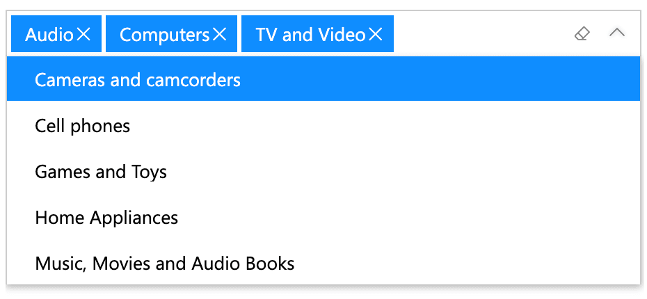

The Dropdown mode in Smart Filter Pro allows you to select items for filtering data by scrolling down a list, or by typing a few keywords and refining your search with an auto-complete list.

 
## Incremental Loading

The Dropdown mode populates the drop-down list using a technique called ***Incremental Loading*** – it doesn't load all the data at once, but requests small blocks of values (5,000) at a time, completing the list incrementally. This means that, with a large volume of data, this process may take several seconds during which some values are not available for queries.  

> You can limit the [number of rows to retrieve](../options/mode/max-rows.md) with a specific option.

> Note that the **Incremental Loading is restarted on each report update** (for example, when changing filters, clicking on any chart/slicer, or changing the active report page), so a large column may slow down the entire report.  
For this reason, the **Dropdown mode is not recommended with fields greater than 30,000 rows**. For larger datasets, the [Filter mode](filter.md) is better, as it doesn't load values into memory, but just apply filters on demand.

## How to Search

Smart Filter Pro in Dropdown mode returns all values **containing** the entered keyword. For example:
- `phone` returns `Telephone`, `Cellphones` and `Phone Accessories`. 

This behavior is different when the [Autocomplete](../options/mode/autocomplete.md) option is enabled. In this case, the visual returns all values **starting with** the keyword entered.  So, with Autocomplete turned on:
- `phone` returns only `Phone Accessories`.

### Case

Search in Dropdown mode is always case insensitive - you can write keywords in any case and the matching algorithm won't rely on that. For example: 
- `Audio` and `audio` produce the same results.

### Operator

In Dropdown mode, all keywords are always applied with the logical **OR** operator, which means that any value that matches at least one of the input keywords is returned as a result.