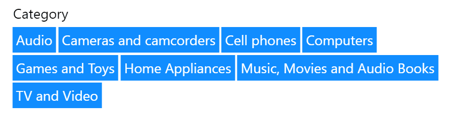

Observer mode makes Smart Filter Pro a narrative visual, by displaying all the applied filters in one place as buttons. This is not a read-only mode, as you can click on every button to apply the relevant filter to the report. In case, there is more than one field connected to the visual, then each one is presented as a separate group.

