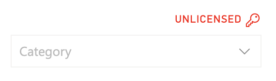
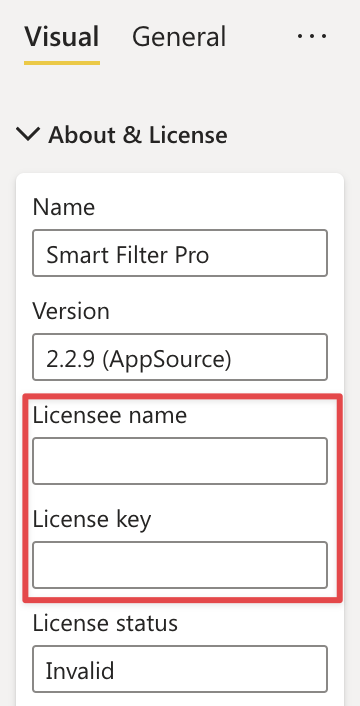

Smart Filter Pro uses a proprietary licensing system that follows a subscription-based model. You can choose the license plan that best suits your needs on our website: [Smart Filter Pro Pricing](https://okviz.com/smart-filter-pro/#pricing)

The Smart Filter Pro licensing works in different ways depending on how you load the visual in your reports:

- ### From a File

    After activating a subscription with us and at each renewal, you will receive the pbiviz file containing Smart Filter Pro by email or you can download it from the your account dashboard on our website.   

    This file is unique to you and **contains your license hard-coded in the package.** This means that the visual is already activated and unlocked; you can install it in the [Org Store](../get-started/org-store.md), drag it into your reports easily and multiple times, or share it within your organization without the need to share license information as well.

    > Also if the license is hard-coded, the visual needs to periodically check your subscription status with our servers. If you are having trouble verifying your license, check if there is a firewall blocking outbound connections. See more on [Data Sent over the Internet](security.md#data-sent-over-the-internet).

- ### From the AppSource

    If you use Smart Filter Pro from AppSource, you must activate each instance of the visual in your reports by entering the licensee name and license key in the dedicated fields.  
    Therefore, **sharing the visual within your organization also requires sharing license information.**

      
    
    

    Additionally, **the visual needs to continually check with our servers the status of your subscription**, producing additional network activity that can be mitigated by using a hard-coded license as described above. 

