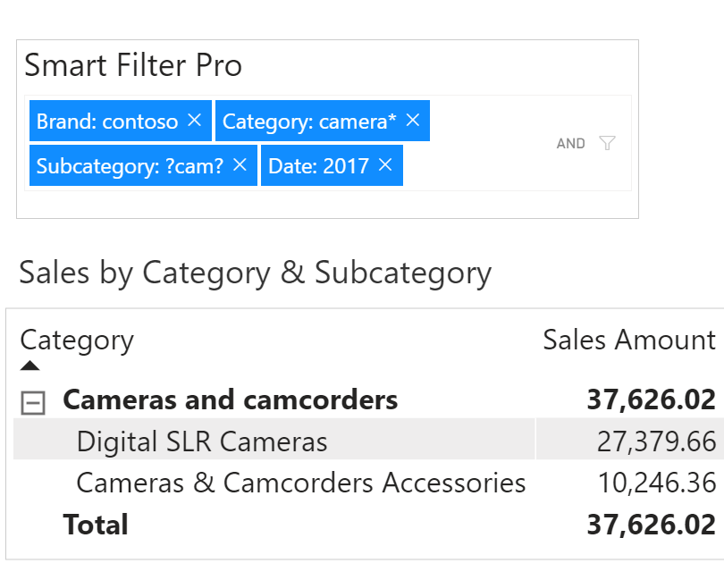

**Default value:** Off

The usual approach to work with Smart Filter Pro on multiple fields is to enter values into several input boxes, one for each connected field. Indeed, when you connect a field to the visual a separate input box is created for that.

Thanks to the ***Consolidate fields*** feature, available in Filter mode only, you can use a single input box to filter multiple fields, which saves valuable space on your report.

To apply a filter to a specific field, when this option is enabled, put the field name and a colon in front of the value to search.  
For example: to search ***Contoso*** in the field ***Brand*** just write `brand:contoso` and hit Enter (field names and value are case insensitive - for more information on the supported syntax see [How to Search in Filter Mode](filter#how-to-search)).

> Note that you can't filter on every field of your dataset without doing anything, **you must first connect every field** you are interested in to the visual.
