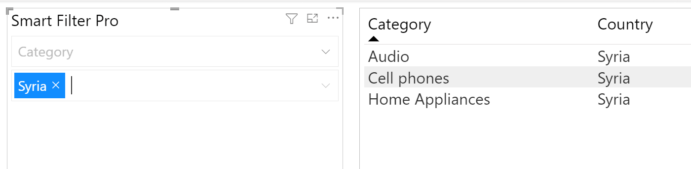
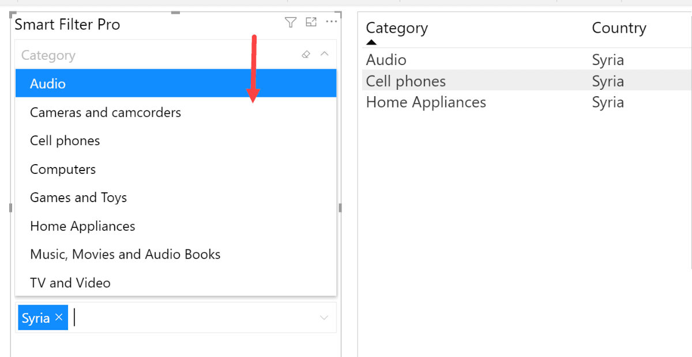

**Default value:** On

When multiple fields are selected for filtering in Smart Filter Pro, cross-filtering allows you to choose if different fields/input boxes filter the others. When users select an item of a field with this option enabled, then the items in the other fields will be automatically filtered based on the value of that item. 
 

To define how cross-filtering works in detail, you need to select its behavior with the option below.

## Cross Filtering Behavior 

**Default value:** Every field

This option allows you to choose how the cross-filtering is applied: 
- [To every field](#every-field)
- [Sequentially](#sequential)

<todo>Retake the screenshot with v2.2.8</todo>
 
### Every field

With Every field option, the cross-filtering feature works for all the fields in similar manner – the filter is applied not only from top to bottom, but also from bottom to top. So, if an item is selected from the first filter, then the second filter dropdown list will only contain possible list of items related to the selected value of first filter. Similarly, if an item is selected from the second filter, then the first filter dropdown list will only contain possible list of items related to the selected value of second filter.

Let us say you have product category and country fields in Smart Filter Pro.  
If you select ***Music, Movies and Audio Books*** from the ***Category*** dropdown, then the ***Country*** dropdown is populated with countries that only contain sales in the ***Music, Movies and Audio Books*** category. 

Similarly, if you choose Armenia from the second filter/dropdown, then the first filter, i.e., the ***Category*** dropdown is automatically filtered – it will populate the product categories that are only sold in Armenia. 

As you see below, all other product categories that are not sold in Armenia are disabled and are not populated in the ***Category*** dropdown list.

The above example is a simplistic one citing only two fields in Smart Filter Pro.  You can use this feature in multiple fields selection as well.

### Sequential
    
With the Sequential option, the cross-filtering feature allows you to apply filter only from top to bottom. So, the second filter dropdown will only populate items related to the first filtered values. However, the first filter will not be affected by any changes in the second one.

For instance, suppose you choose a country Syria that has only sold products in three categories. However, with the Sequential option selected, the ***Category** dropdown list will still contain all the categories.

So, you can see that even though there are only three possible categories for Syria, but the ***Category*** dropdown list is still showing all the available categories with the cross-filtering behavior working only from top to bottom.

### Legacy

If you used the cross-filtering feature before [v2.2.5](../changelog#v225), you may see unexpected results with other behaviors.
If this is the case, you can use the Legacy option as cross-filtering behavior.

> Note that this option uses a different, outdated approach and it's still available for back compatibility only.
