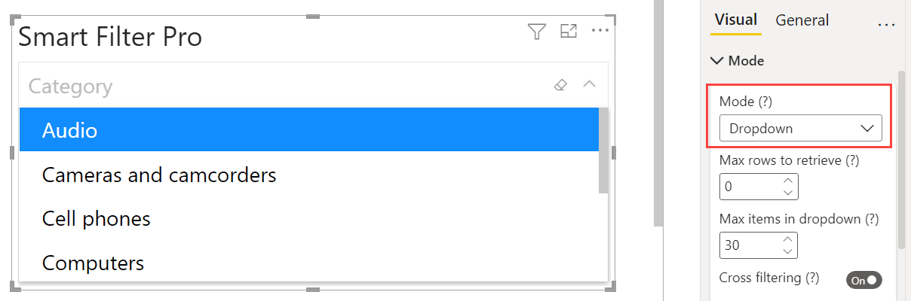

The Dropdown mode in Smart Filter Pro allows you to select items for filtering data by scrolling down a list, or by typing a few keywords and refining your search with an auto-complete list.

 
## How to Search

<todo>Explain how search works in this mode (wildcards support, case sensitive/insensitive) with examples - Mention that the "Contains" vs "Start with" match is affected by the Autocomplete option.</todo>

## Options

On selecting the Dropdown mode, the options available are:
- [Autocomplete](autocomplete)
- [Compress Multiple](compress-multiple)
- [Cross Filtering](cross-filtering)
- [Empty when no Selection](empty-when-no-selection)
- [Max Items in Dropdown](max-items-in-dropdown)
- [Max Rows to Retrieve](max-rows)
- [Max Selectable Items](max-selectable-items)
- [Single Selection](single-selection)
- [Split Pasted Text by](split-pasted-text)