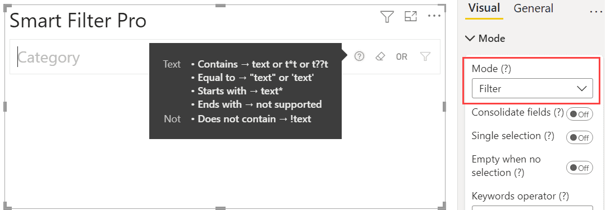

The Filter mode in Smart Filter Pro allows advanced data queries by defining conditions using wildcards, comparison, and logical operators. The filter conditions – one or more – are written with a simple syntax giving instant results. One can search for specific date intervals, for numbers smaller or greater than others, for strings within a piece of text, and so on. 

By allowing advanced search conditions for filtering, the Filter mode helps refine your search and eliminate any restrictions on which elements in a column to filter. For instance, the filter semantic that can be applied to the dates allows the user to specify complex rules in filtering dates that are not possible to define using the default slicers.

The Filter mode is very useful when you are dealing with huge datasets, and loading all data in memory can be very expensive. The other modes (except [Search mode](search), which is similar to Filter mode) loads all the data in memory, so it can be slow in certain conditions. On the other hand this mode uses [a different approach that helps boost performance](#performance-boost) and load large datasets faster than ever.

## How to Search

Unlike the Dropdown mode, which only allows simple exact match queries, Filter mode supports advanced and powerful queries that you can you use to slice your data in a unique way.

The syntax available differs depending on the type of the field to the visual, so here are the options for each type. Multiple conditions are combined using a [logical operator](#operators) specific of each field.

> The syntax here is also supported by the Search mode. Learn more about the [differences between Filter and Search modes](search#differences-between-search-and-filter-modes).

### Text Search

The syntax for querying text fields includes rules for the most common uses:
           
- #### Containing Text {#contains}
    You can perform a search that returns values containing your keyword without using any special characters if the [Default Condition for Text](default-text-condition) is set to ***Contains***, otherwise you can use the wildcard characters ***\**** and ***?*** to define the part of the string you don't know along with your keyword. 

    The character ***\**** is used to define an unknow string of any length.   
    The character ***?*** defines a single unknown character.

    > You can use as many wildcards as you like and in any position with one exception: you can't put a wildcard at the beginning of a string if there isn't the same character at the end as well - in other words, the ***Ends with*** search is not supported.

    For example:
    - `audio` returns all values containing ***audio*** if the default condition for text is ***Contains***, otherwise returns all values equal to ***audio*** (see [Exact Match](#exact)).
    - `*audio*` returns all values containing ***audio***.
    - `aud*` returns all values starting with ***aud***.
    - `*udio` **is not supported** and won't return any results.
    - `a??io` returns values starting with ***a***, followed by two characters and ending with ***io***.

    <todo>Take a screenshot</todo>
- #### Exact match {#exact}
    You can perform an exact match search without using any special characters if the [Default Condition for Text](default-text-condition) is set to ***Equal to***, otherwise you need to enclose your keyword in double quotes.

    For example:
    - `audio` returns all values equal to ***audio*** if the default condition for text is ***Equal to***, otherwise returns all values containing ***audio*** (see [Containing Text](#contains)).
    - `"audio"` returns all values equal to ***audio***.

    <todo>Take a screenshot</todo>

- #### Not Containing/Match Text

   You can exclude a particular value from the results by prefixing the character ***!*** to your keyword.  
   You can combine this with the other rules to create an advanced query.

    
   For example: 
   - `!audio` returns all values except those that include ***audio*** if the [Default Condition for Text](default-text-condition) option is ***Contains***, otherwise returns all values except those equal to ***audio***.
   - `!*audio*` returns all values except those that include ***audio***.
   - `!aud*` returns all values except those starting with ***aud***.
   
   <todo>Take a screenshot</todo>

    > The Not condition is quite limited - **you cannot add more than 20 keywords with Not** in the same query.

### Date Search

The Filter mode provides a simple syntax to perform advanced queries on date fields:

> 
    The recommended format for entering dates is [ISO 8601](https://en.wikipedia.org/wiki/ISO_8601), but you can use a slight variation that best suits you. For example: `2018-01-15`, `2018.1.15` or `20180115` are all valid and represent ***Jan 15, 2018***.

- #### Dates Comparison

    You can use the common comparison operators to search for dates:
    - `2018-01-15` (no operators) searches for an **exact match**.
    - `>2018-01-15` apply a **greater than** comparison.
    - `>=2018-01-15` apply a **greater than or equal to** comparison.
    - `<2018-01-15` apply a **less than** comparison.
    - `<=2018-01-15` apply **less than or equal to** comparison.
    - `!2018-01-15` searches for dates different from the one provided – **max 20 of these comparisons are allowed**.

   Date comparisons are not limited to days, you can also enter years or months and the filter will transform them to the first day of the period, if the comparison uses ***>***, and to the last day, if the operator is ***<***. 
   
   For example:
   - `>2018` means `>2017-12-31`  
   - `<2018-01` means `<2018-01-01`  
   - `2018` or `!2018` means that you are searching for a date range. See below for more details.

   <todo>Take a screenshot</todo>
- #### Date Ranges

    You can query date ranges by combining two different comparisons and using the [AND operator](#operators), or you can just use one of these shorthand syntaxes:

    - ##### Year  
        You can query a single a year with a 4-digit number, instead of two conditions.  
        For example: 
        - `2018` is equivalent to `>=2018-01-01` AND `<=2018-12-31` 
        - `!2018` is equivalent to `<2018-01-01` AND `>2018-12-31`

    - ##### Years Range 
        You can query a range of years with two numbers connected by a dash ***_***.  
        For example: 
        - `2018_2021` is equivalent to `>=2018-01-01` AND `<=2021-12-31`

    - ##### Month 
        You can query a single month with a **ISO 8601** number (or a variation of it).  
        For example: 
        - `2018-01` is equivalent to `>=2018-01-01` AND `<=2018-01-31`

    - ##### Months Range
        As for the years, you can create complex ranges by using a dash ***_*** with months.  
        For example: 
        - `2018.1_2021.6` is equivalent to `>=2018-01-01` AND `<=2021-06-30`

    - ##### Days Range 
        The dash ***_*** is available also with days - use the [ISO 8601 format](#ISO8601) as described above.  
        For example: 
        - `20180115_20210615` is equivalent to `>=2018-01-15` AND `<=2021-06-15`  

    <todo>Take a screenshot</todo>

    > Note that these shortened ranges are inclusive - the first and last date of the range are always included.

### Number Search

The syntax available for date fields is also supported by number fields. You can enter a number to perform an exact match search, you can perform standard comparisons, you can use the Not ***!*** operator, and defines ranges with dash ***_***:

- `100` means an **exact match.**
- `>100` means **greater than** comparison.
- `>=100` means **greater than or equal to** comparison.
- `<100` means **less than** comparison.
- `<=100` means **less than or equal to** comparison.
- `!100` means **not** comparison.
- `100_200` searches for a range of values between ***100*** and ***200***.

<todo>Take a screenshot</todo>

### Case

Search in Filter mode is always case insensitive - you can write keywords in any case and the matching algorithm won't rely on that.  
For example: 
- `Air conditioners`, `air conditioners`, and `Air Conditioners` produce the same results.

### Operators

In Filter mode you can choose the logical operator to combine different conditions for each field. This means that all conditions share the same operator, but you can have different operators in each field.

<todo>Take a screenshot with different condition in different fields</todo>

The available operators are:
- #### AND
    Use it when you want all the specified conditions to be satisfied.

    <todo>Take a screenshot with interactive AND</todo>

- #### OR
    Use it when you want at least one of the specified conditions to be satisfied.

    <todo>Take a screenshot with interactive OR</todo>

You can set the operator with a specific option: [Keywords Operator](keywords-operator).

## Performance Boost

One of the main advantages of the Filter mode is the performance boost it offers. The Dropdown, Observer, and Hierarchy modes load all the items in memory, regardless of the filters applied by the user. **The Filter mode is faster as it doesn't load the values at all, but only applies a filter to the report.** 

> In Dropdown, Observer, and Hierarchy modes, data is loaded incrementally when the visual is rendered and whenever a filter is applied to the report from any other visual. This means that clicking on any chart to slice the data in the report reactivates the process and could take many seconds to complete, depending on the amount of rows in the column.

The performance boost is more evident when we use a high cardinality column – a column that displays multiple distinct values – for filtering data. For instance, let us say you use the Dropdown mode and select ***Order Number*** – a high cardinality column – from the ***Sales*** table. 

<todo>Take a screenshot of the example</todo>

When you start typing order numbers in the textbox, the order numbers do not appear as immediately as they would for a column which is not a high cardinality column – ***Product Category***, for example.  Thus, the result set loading time is longer in Dropdown mode.

Moreover, loading many items in the visual increases the memory consumed, potentially creating performance issues for other applications running on the same machine. While in Filter mode, the values are not loaded at all; a filter is applied to the report so that the data that does not fit the filter rule is not loaded at all. In these conditions, the user experience is better with the Filter mode as it uses less system memory. 

## No Data Limits

Another benefit of Filter mode is that there are no limits on the volume of the dataset it can filter, because it doesn't load data into memory and therefore the common [limits set by Power BI](https://docs.microsoft.com/en-us/power-bi/developer/visuals/fetch-more-data#known-limitations-of-fetchmoredata) don't apply here. The other modes (except Search mode), on the other hand, cannot load more than **1,048,576 rows** and cannot exceed more than **100 MB of memory**.

## Options

On selecting the Filter mode, the options available are:
- [Consolidate Fields](consolidate-fields)
- [Default Condition for Text](default-text-condition)
- [Empty when no Selection](empty-when-no-selection)
- [Keywords Operator](keywords-operator)
- [Single Selection](single-selection)
- [Split Pasted Text by](split-pasted-text)