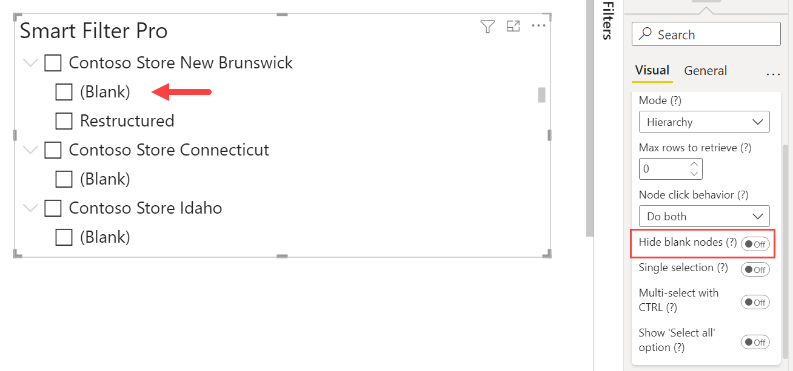
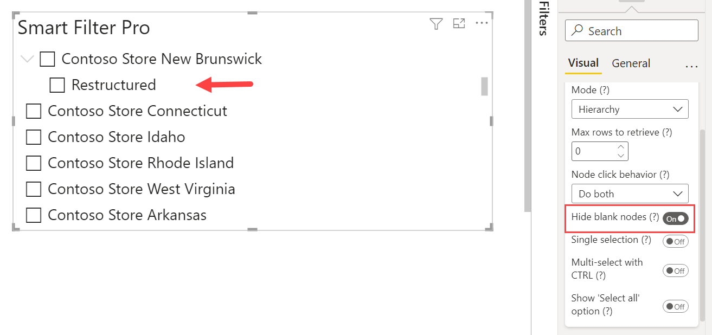

**Default value:** Off

This option, if enabled, hides the nodes without data from a hierarchy view. In other words, it does not display the items with value (Blank) in the tree. 

  

For instance, the field Status in the Store table has three possible values: Closed, Restructured, and (Blank). If you enable the Hide blank nodes option, then the Blank node will be hidden from the tree in Smart Filter Pro.
 

