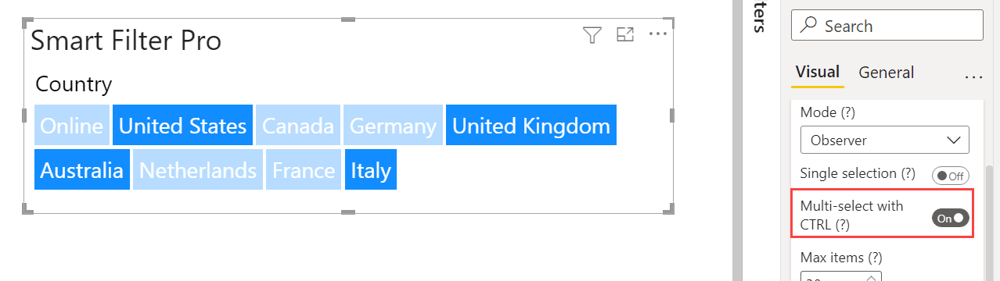
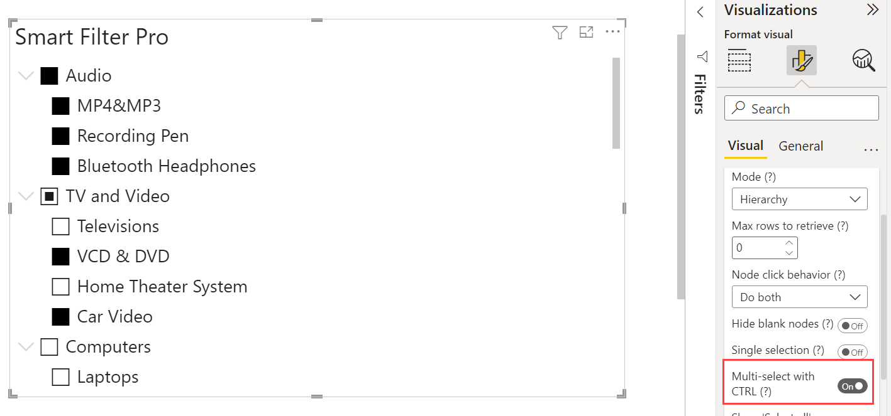

**Default value:** On (Observer), Off (Hierarchy)

This option, when enabled, allows multiple selections for applying filter when CTRL + click (Cmd + click on Mac) is used. 

In Observer mode, the selected items will be highlighted in the input box, and all other items will be greyed out.

In Hierarchy mode, the selected state of nodes is kept when you click on different checkboxes.

<todo assign="twinkle">Take a screenshot for Hierarchy mode</todo>
