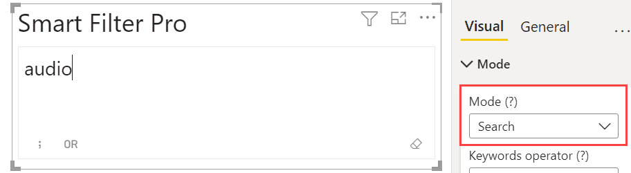
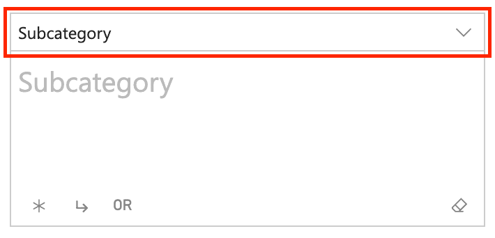

Search mode is the simplified version of the [Filter mode](filter). This working mode is faster and easier to use. It allows entering or pasting a long list of values and dynamic searching without sacrificing the overall performance. The Search mode allows to apply filters even automatically on typing.

The Search mode supports multiple fields, like the other modes, but only allows you to search for one field at a time. In case you connect multiple fields, a drop-down menu appears at the top of the visual from which you can select the field to search for.

<todo>Retake the screenshot with the fields panel side by side with visual</todo>

## How to Search

The search is performed in the same way and with the [same syntax available in Filter mode](filter#how-to-search), with the difference that the syntax here can be limited to a simplified version using the option [Matching](matching), consisting of a case-insensitive exact match search.

## Differences between Search and Filter Modes

<todo>TODO</todo>

## Options

On selecting the Search mode, the options available are:
- [Empty when no Selection](empty-when-no-selection)
- [Matching](search-matching)
- [Keywords Operator](keywords-operator)
- [Search on Paste](search-on-event#search-on-paste)
- [Search on Typing](search-on-event#search-on-typing)
- [Split Text by](split-text)